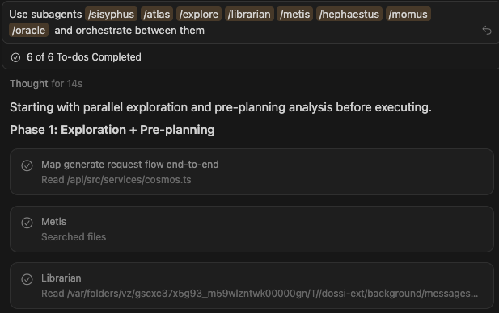
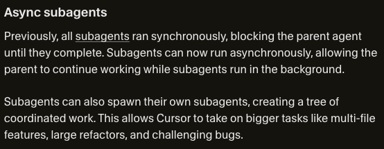
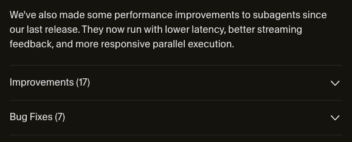
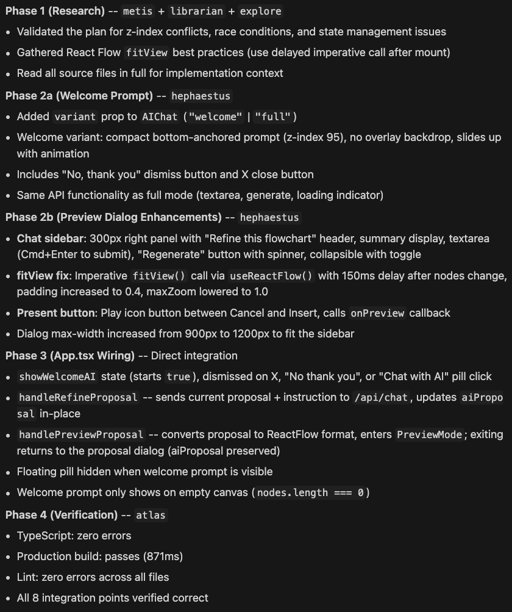
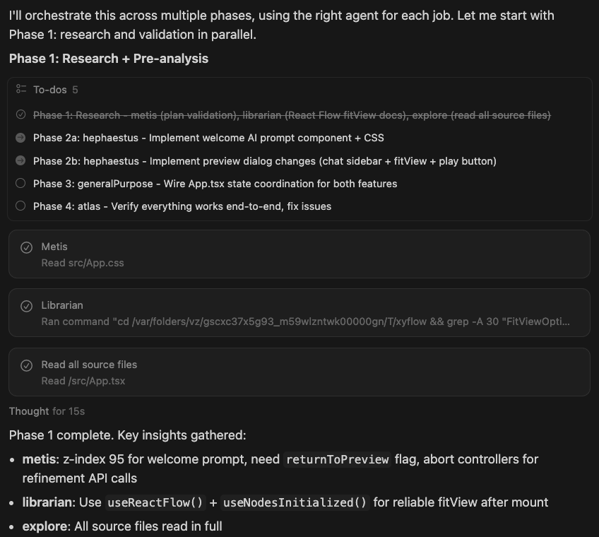
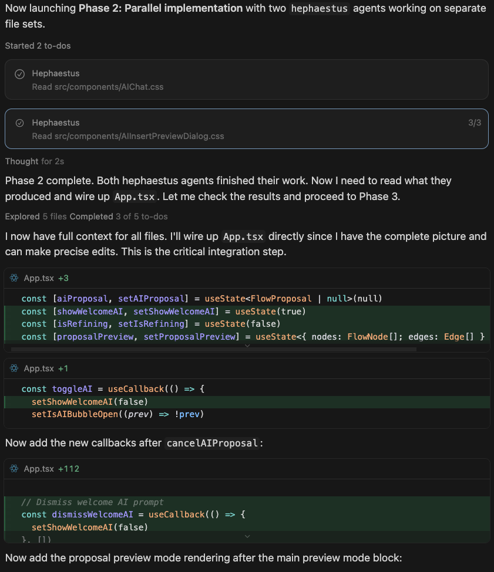
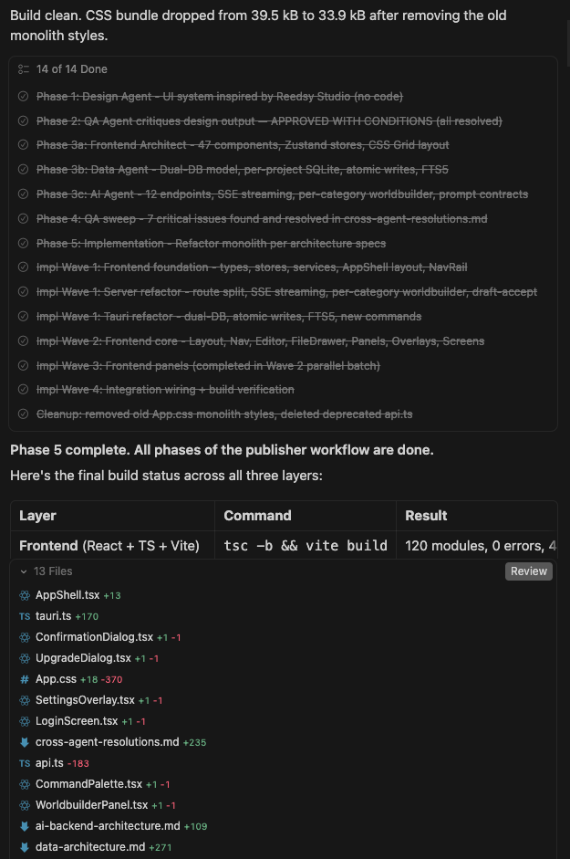
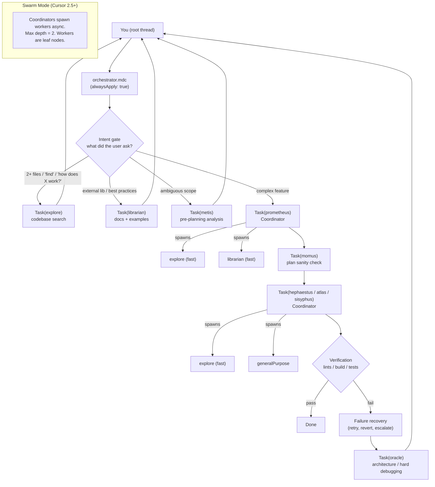

<p align="center">
  <a href="https://github.com/tmcfarlane/oh-my-cursor">
    <picture>
      <source srcset="screenshots/prompt.png" media="(prefers-color-scheme: dark)">
      <source srcset="screenshots/prompt.png" media="(prefers-color-scheme: light)">
      
    </picture>
  </a>
</p>

<div align="center">

<div style="font-size: 2.2em; font-weight: 800; line-height: 1.15;">
  <strong>oh-my-cursor</strong> by <a href="https://zeroclickdev.ai/">ZeroClickDev</a>
</div>

Bringing the [32k-star oh-my-opencode](https://github.com/code-yeongyu/oh-my-opencode) to Cursor subagents.<br>
**Multi-agent orchestration, natively**, using nothing but a few config files.

<details>
<summary><strong>Cursor 2.5 — Released Feb 17th, 2026 — <span style="color: red;">SWARM MODE ACTIVATED!</span></strong><br>Updated to take advantage of new features and improvements.</summary>

<p align="center">
  <a href="https://cursor.com/changelog#async-subagents" style="display: flex; flex-direction: column; align-items: center;">
    <picture style="display: block;">
      <source srcset="screenshots/cursor_update_1.png" media="(prefers-color-scheme: dark)">
      <source srcset="screenshots/cursor_update_1.png" media="(prefers-color-scheme: light)">
      
    </picture>
    <picture style="display: block;">
      <source srcset="screenshots/cursor_update_2.png" media="(prefers-color-scheme: dark)">
      <source srcset="screenshots/cursor_update_2.png" media="(prefers-color-scheme: light)">
      
    </picture>
  </a>
</p>
</details>

</div>


## Quick Start (One Command)

Install to **user scope** (applies to all Cursor projects):

```bash
curl -fsSL https://raw.githubusercontent.com/tmcfarlane/oh-my-cursor/main/install.sh | bash
```

## What Is This?

`oh-my-cursor` is a curated set of Cursor agent manifests plus **one** always-on orchestration rule:

- **agents**: specialized roles (explore, librarian, planner, executor, reviewer...)
- **orchestrator**: a single rule (`orchestrator.mdc`) that tells the root thread **when** to delegate, **who** to delegate to, and **how** to verify results

No external runtime. No wrapper CLI. **Just Cursor's built-in `Task` subagents** (this capability landed in January and makes this whole setup surprisingly clean).


## How to Install
```bash
# Install to user scope (applies to all Cursor projects)
curl -fsSL https://raw.githubusercontent.com/tmcfarlane/oh-my-cursor/main/install.sh | bash

# Install to this project only (./.cursor/)
curl -fsSL https://raw.githubusercontent.com/tmcfarlane/oh-my-cursor/main/install.sh | bash -s -- --project

# Preview changes
curl -fsSL https://raw.githubusercontent.com/tmcfarlane/oh-my-cursor/main/install.sh | bash -s -- --dry-run

# Update/overwrite existing files
curl -fsSL https://raw.githubusercontent.com/tmcfarlane/oh-my-cursor/main/install.sh | bash -s -- --force

# Uninstall
curl -fsSL https://raw.githubusercontent.com/tmcfarlane/oh-my-cursor/main/install.sh | bash -s -- --uninstall
```

### What Gets Installed

| Scope | Agents | Rules |
|------|--------|-------|
| `--user` (default) | `~/.cursor/agents/` | `~/.cursor/rules/orchestrator.mdc` |
| `--project` | `./.cursor/agents/` | `./.cursor/rules/orchestrator.mdc` |

<span style="color: lightsteelblue;">***Rule Priority (Important)***</span>

If you have multiple Cursor rules, make sure `orchestrator.mdc` is **enabled** and **high priority** (so it's applied early and consistently). If your rules UI supports ordering, move it up; if you rely on naming, prefixing it (e.g. `000-orchestrator.mdc`) works well.


## Prompting Tips (Most Effective Pattern)

The orchestrator rule does a great job on its own, but I've found it's still most effective to:

- **tag agents in the starting prompt**, and
- explicitly tell the model to **orchestrate among them**

Example:

```text
You are the orchestrator. Use @explore to map the codebase, @prometheus to draft a plan, @momus to review it,
and @hephaestus/@atlas to implement. Verify with lints/build/tests. Keep going until done.
```

## The Origin Story (aka: Token Optimization for Degenerates)

I upgraded my Cursor account to Ultra right before my usage was going to roll over.

Then I realized I had **9 days** to burn roughly **$300 worth of tokens** to truly min/max the subscription rollover period.

So I did what any natural-born crayon eating ape would do:

- I tried overengineering around CursorCLI
- I decided it wasn't ready for the kind of nonsense I had planned
- I jumped back into the UI
- I realized I could basically clone the methodology behind **oh-my-opencode**
- and that **all it takes** is dropping some files into Cursor config + one prioritised orchestration rule

Result: **oh-my-cursor Agent Swarms** that do real work and also help you responsibly (irresponsibly) "optimize" your token burn.


## Agents Included

You get a cast of specialists (all just Markdown manifests):

| Agent | Role |
|------|------|
| `explore` | Codebase search & pattern discovery |
| `librarian` | External docs + OSS examples |
| `prometheus` | Planning |
| `momus` | Plan review (blocking issues only) |
| `hephaestus` | Deep multi-file implementation |
| `atlas` | Step-by-step executor with obsessive verification |
| `sisyphus` | Disciplined multi-step execution + codebase assessment |
| `oracle` | Architecture / hard debugging |
| `generalPurpose` | Focused single-domain work |
| `metis` | Ambiguity / intent analysis |
| `multimodal-looker` | PDFs/images/diagrams |


## Screenshots

**1. Prompt** — Subagents and Phase 1 exploration


**2. Orchestration phases** — Phase breakdown diagram



**3. Phase 1** — Codebase Assessment



**4. Phase 2** — Agent Dispatch



**5. Phase final** — Phase 5 complete, final build status




## <span style="color: red;">Cursor Swarm Mode (v2.5+)</span>

With Cursor 2.5, subagents can spawn their own subagents asynchronously. This repo now uses a **two-tier swarm architecture**:

- **Coordinators** (Tier 1): `hephaestus`, `prometheus`, `atlas`, `sisyphus` -- can spawn worker subagents for parallel research and implementation
- **Workers** (Tier 2): `explore`, `librarian`, `generalPurpose` -- leaf nodes that execute focused, bounded tasks
- **Root-only workers** (Tier 2): `oracle`, `metis`, `momus`, `multimodal-looker` -- leaf nodes dispatched exclusively by the root thread (never by coordinators)

Max depth is 2: root thread spawns coordinators, coordinators spawn workers. Workers never delegate further.

Coordinators use the **fast model tier** for search workers (`explore`, `librarian`) and inherit the parent model for implementation workers requiring deeper reasoning.

### Swarm Coordinator Protocol

The shared coordination rules live in **`agents/protocols/swarm-coordinator.md`**. It defines depth guards, delegation decision matrix, model selection, async patterns, and context relay rules.

**How it's used:**

- **Installation**: The installer copies `protocols/swarm-coordinator.md` into your agents directory (e.g. `~/.cursor/agents/protocols/` or `./.cursor/agents/protocols/`), alongside the agent manifests.
- **Reference**: Each coordinator manifest (`hephaestus`, `prometheus`, `atlas`, `sisyphus`) instructs the agent to "Follow the Swarm Coordinator Protocol" and points to `protocols/swarm-coordinator.md` (installed location). The protocol is the single source of truth; coordinator manifests also embed a short summary (allowed workers, depth guard) so basic rules are always in context.
- **At runtime**: Coordinators get their manifest text by default. For the full protocol to apply, the protocol file can be brought into context (e.g. by @-mentioning `@agents/protocols/swarm-coordinator.md` when delegating, or by the agent reading it from the workspace). The in-manifest summary is always available even if the full file is not loaded.

## Remaining Limitations (Honest Section)

- **Two model tiers only**: subagents can run on the parent model or a faster/cheaper model -- no arbitrary per-agent model routing (unlike oh-my-opencode which routes to different providers per agent).
- **Skills aren't scoped per agent**: it'd be fantastic if subagents could see a curated subset of skills instead of "all or nothing".

>If Cursor ever adds per-agent model selection + skill scoping, this repo gets even more powerful overnight!!!


## How The Swarm Works (Mermaid Diagram)

The root thread orchestrates **coordinators** (Tier 1) which can spawn their own **workers** (Tier 2). Max depth = 2.




## FAQ

#### Do I need to manually choose agents?

Not strictly — the orchestrator can auto-trigger delegation — but it's often best to **explicitly tag agents** in your first prompt for maximum determinism.

#### Will this work on any Cursor plan?

If your plan supports agent mode / subagents, yes. These files don't "add" capabilities; they **shape** the capabilities Cursor already has.

#### How do I update?

Re-run the installer with `--force`:

```bash
curl -fsSL https://raw.githubusercontent.com/tmcfarlane/oh-my-cursor/main/install.sh | bash -s -- --force
```

#### How do I uninstall?

```bash
curl -fsSL https://raw.githubusercontent.com/tmcfarlane/oh-my-cursor/main/install.sh | bash -s -- --uninstall
```

---

## License

MIT. See [LICENSE](LICENSE).

## Inspiration

**[oh-my-opencode](https://github.com/code-yeongyu/oh-my-opencode)** is the 32k+ star project that turned OpenCode into a multi-agent orchestration platform — so impactful that **Anthropic cited it by name** when restricting third-party OAuth access in January 2026. This repo adapts its philosophy (agent specialization, parallel dispatch, phased orchestration, todo enforcement) to Cursor's native `Task` subagents. No plugin system, no wrapper CLI — just Markdown config files.

## Star History

[](https://www.star-history.com/#tmcfarlane/oh-my-cursor&type=date&legend=top-left)
