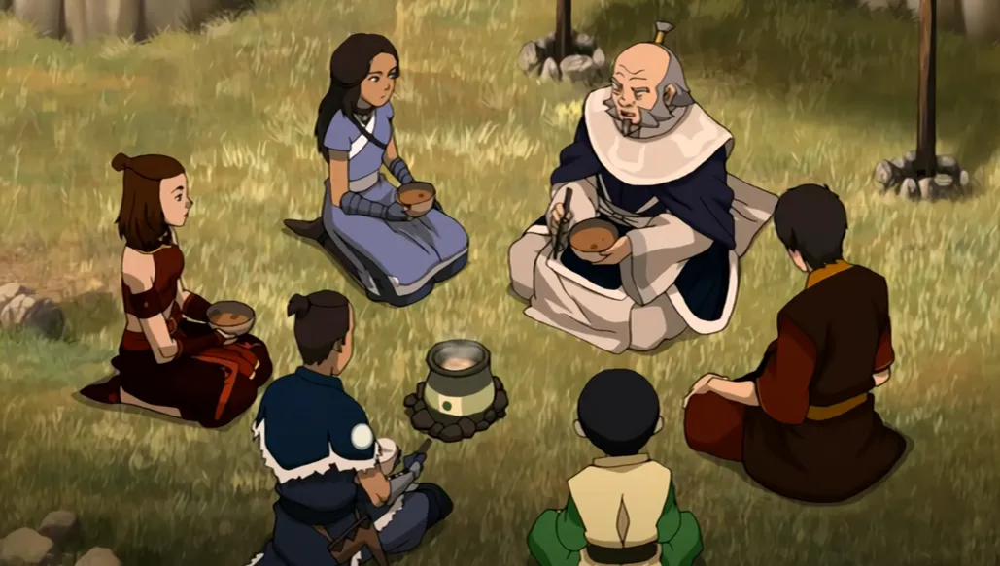
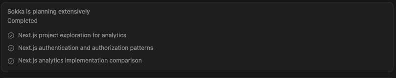
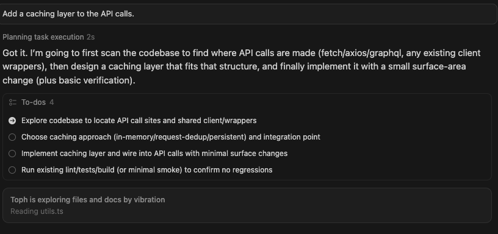
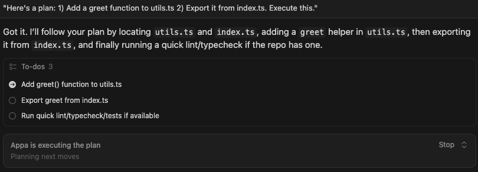
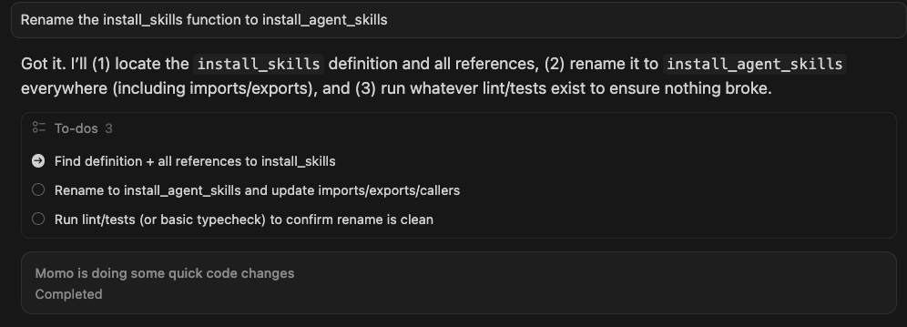
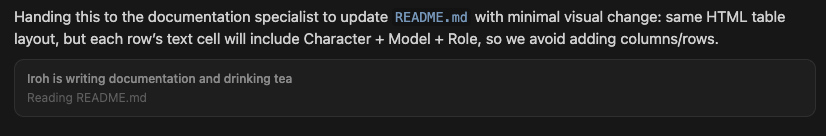
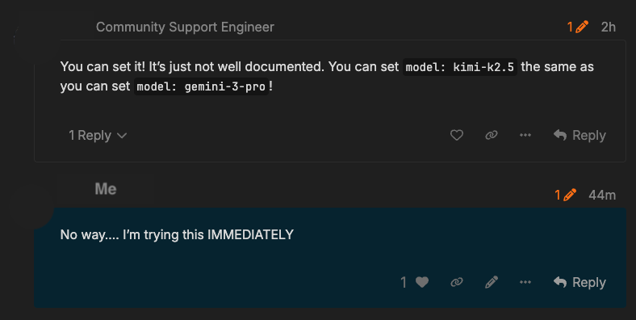
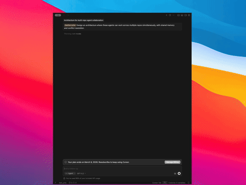
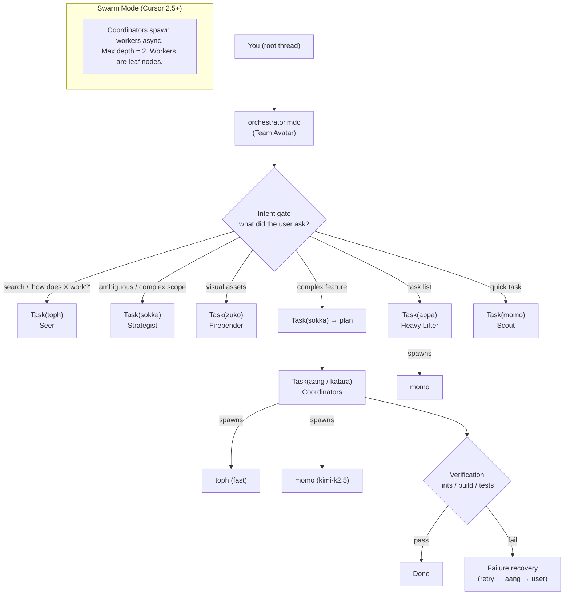

<div align="center">

<div style="font-size: 2.0em; font-weight: 800; line-height: 1.1;">
  <strong>oh-my-cursor</strong>
</div>

<div style="font-size: 0.85em; font-weight: 400; letter-spacing: 0.25em; text-transform: uppercase; margin: 4px 0;">presents</div>

<p align="center">
  <a href="https://github.com/tmcfarlane/oh-my-cursor">
    
  </a>
</p>
<div style="font-size: 2.5em; font-weight: 700; letter-spacing: 0.12em;">
  <strong>TEAM AVATAR</strong>
</div>

Multi-agent philosophy for Cursor subagents. Nothing but config files.<br>
*Created by <a href="https://zeroclickdev.ai/">ZeroClickDev</a>*

**NOW USING UNDOCUMENTED FEATURES OF CURSOR!**
<br>
 
</div>


## Quick Start (One Command)

```bash
curl -fsSL https://raw.githubusercontent.com/tmcfarlane/oh-my-cursor/main/install.sh | bash
```

## What Is This?

`oh-my-cursor` is a curated set of **8 agent manifests**, **8 slash commands**, **hooks**, and **one orchestration rule** -- themed around Avatar: The Last Airbender.

- **agents**: Team Avatar -- specialized roles mapped to ATLA characters (Aang, Sokka, Katara, Zuko, Toph, Appa, Momo, Iroh)
- **commands**: Slash commands (`/plan`, `/build`, `/search`, `/fix`, `/tasks`, `/scout`, `/doc`, `/cactus-juice`) for explicit orchestration control
- **hooks**: System-level lint verification and constraint enforcement
- **orchestrator**: A single rule (`orchestrator.mdc`) that coordinates everything -- "Team Avatar"

No external runtime. No wrapper CLI. **Just Cursor's built-in `Task` subagents.**

**NOW USING UNDOCUMENTED FEATURES OF CURSOR.**  
> Team Avatar relies on Cursor accepting custom strings in agent `model:` frontmatter for per-agent routing. It’s unofficial and may change; see [Undocumented: Custom Model Aliases](#undocumented-custom-model-aliases).


## Always Use the Orchestrator

The orchestrator rule (`orchestrator.mdc`) isn't decoration — it rewires how the root thread thinks. Here's a real example of the root thread's internal reasoning when asked to update installation instructions:

> **Planning Installation Instructions**
>
> I need to follow the orchestrator's guidance, since the root can't use Read directly and must delegate via Task. I have to document this in the README and use iroh, but I'm unsure about the new installation instructions, which might be documented elsewhere. It's critical to know these details, so I could search the repository with iroh/toph for existing install docs. I'll have to organize a plan: dispatch toph to find the installation instructions and have iroh update the README after. Plus, I'll create a to-do list to keep track of everything.

Every sentence maps to an orchestrator rule:

- **"the root can't use Read directly"** — The root thread is a pure dispatcher. Its only permitted tools are `Task`, `TodoWrite`, `AskQuestion`, and `SwitchMode`. Every other tool is forbidden.
- **"must delegate via Task"** — All work flows through the `Task` tool. No exceptions, no shortcuts, no matter how small or obvious the operation.
- **"use iroh"** — Agent routing in action. Documentation tasks route to Iroh. The root matches intent to the correct specialist before dispatching.
- **"search the repository with toph"** — Toph handles all exploration, search, and "how does X work?" queries. The root never searches directly.
- **"dispatch toph... have iroh update after"** — Phase chain orchestration: Toph explores first, Iroh writes second. Output from phase N becomes context for phase N+1.
- **"create a to-do list"** — Two or more steps triggers `TodoWrite` immediately. The orchestrator enforces task tracking for every complex operation.

## Team Avatar -- The Agents

Eight specialized agents, each mapped to an Avatar character with a dedicated model and role:

<table>
<tr>
<td align="center" width="100" valign="top">
  <a href="screenshots/faces/aang.webp" target="_blank" rel="noopener noreferrer"></a>
</td>
<td valign="top">
  <strong>Aang</strong><br>
  <em>The Avatar</em> · <code>claude-4.6-sonnet</code> · Deep multi-file executor + architecture consultant. Masters all elements.<br>
  <strong>Agent Swarm</strong> — Multi-agent orchestration in action<br>
  Skills: <a href="skills/design-patterns-implementation/SKILL.md"><code>design-patterns-implementation</code></a>, <a href="skills/refactoring-patterns/SKILL.md"><code>refactoring-patterns</code></a>, <a href="skills/vercel-react-best-practices/SKILL.md"><code>vercel-react-best-practices</code></a>
</td>
<td align="right" width="460" valign="top">
  <a href="screenshots/teamavatar/aang.png" target="_blank" rel="noopener noreferrer"></a>
</td>
</tr>
<tr>
<td align="center" width="100" valign="top">
  <a href="screenshots/faces/sokka.webp" target="_blank" rel="noopener noreferrer"></a>
</td>
<td valign="top">
  <strong>Sokka</strong><br>
  <em>The Strategist</em> · <code>claude-4.6-opus</code> · Planning, ambiguity analysis, plan review. The brain behind every mission.<br>
  <strong>Ask First, Dispatch Second</strong> — The orchestrator clarifies before sending agents<br>
  Skills: <a href="skills/architect/SKILL.md"><code>architect</code></a>, <a href="skills/planning/SKILL.md"><code>planning</code></a>, <a href="skills/technical-roadmap-planning/SKILL.md"><code>technical-roadmap-planning</code></a>
</td>
<td align="right" width="460" valign="top">
  <a href="screenshots/teamavatar/sokka.png" target="_blank" rel="noopener noreferrer"></a>
</td>
</tr>
<tr>
<td align="center" width="100" valign="top">
  <a href="screenshots/faces/katara.webp" target="_blank" rel="noopener noreferrer"></a>
</td>
<td valign="top">
  <strong>Katara</strong><br>
  <em>The Healer</em> · <code>claude-4.6-sonnet</code> · Disciplined implementation, debugging, methodical fixes. Mends broken code.<br>
  <strong>Precision Healer</strong> — Surgical debugging, smallest possible fix<br>
  Skills: <a href="skills/debugging/SKILL.md"><code>debugging</code></a>, <a href="skills/refactoring/SKILL.md"><code>refactoring</code></a>, <a href="skills/refactoring-patterns/SKILL.md"><code>refactoring-patterns</code></a>
</td>
<td align="right" width="460" valign="top">
  <a href="screenshots/teamavatar/katara.png" target="_blank" rel="noopener noreferrer"></a>
</td>
</tr>
<tr>
<td align="center" width="100" valign="top">
  <a href="screenshots/faces/zuko.webp" target="_blank" rel="noopener noreferrer"></a>
</td>
<td valign="top">
  <strong>Zuko</strong><br>
  <em>The Firebender</em> · <code>gemini-3.1-pro</code> · Visual design: image generation, icons, UI mockups. Brings designs to life.<br>
  <strong>Fire and Finesse</strong> — Image generation, icons, and UI mockups<br>
  Skills: <a href="skills/create-an-asset/SKILL.md"><code>create-an-asset</code></a>, <a href="skills/implementing-figma-designs/SKILL.md"><code>implementing-figma-designs</code></a>, <a href="skills/web-design-guidelines/SKILL.md"><code>web-design-guidelines</code></a>
</td>
<td align="right" width="460" valign="top">
  <a href="screenshots/teamavatar/zuko.png" target="_blank" rel="noopener noreferrer"></a>
</td>
</tr>
<tr>
<td align="center" width="100" valign="top">
  <a href="screenshots/faces/toph.webp" target="_blank" rel="noopener noreferrer"></a>
</td>
<td valign="top">
  <strong>Toph</strong><br>
  <em>The Seer</em> · <code>fast</code> · Codebase search, external docs, media analysis. Sees everything.<br>
  <strong>Seismic Sense</strong> — Multi-angle codebase search and doc exploration<br>
  Skills: <a href="skills/codebase-search/SKILL.md"><code>codebase-search</code></a>, <a href="skills/exploring-codebases/SKILL.md"><code>exploring-codebases</code></a>, <a href="skills/mgrep-code-search/SKILL.md"><code>mgrep-code-search</code></a>
</td>
<td align="right" width="460" valign="top">
  <a href="screenshots/teamavatar/toph.png" target="_blank" rel="noopener noreferrer"></a>
</td>
</tr>
<tr>
<td align="center" width="100" valign="top">
  <a href="screenshots/faces/appa.webp" target="_blank" rel="noopener noreferrer"></a>
</td>
<td valign="top">
  <strong>Appa</strong><br>
  <em>The Heavy Lifter</em> · <code>kimi-k2.5</code> · Systematic task list execution. Carries the team.<br>
  <strong>Heavy Lifter</strong> — Systematic task list execution, one step at a time<br>
  Skills: <a href="skills/frontend-builder/SKILL.md"><code>frontend-builder</code></a>, <a href="skills/vercel-composition-patterns/SKILL.md"><code>vercel-composition-patterns</code></a>, <a href="skills/vercel-react-best-practices/SKILL.md"><code>vercel-react-best-practices</code></a>
</td>
<td align="right" width="460" valign="top">
  <a href="screenshots/teamavatar/appa.png" target="_blank" rel="noopener noreferrer"></a>
</td>
</tr>
<tr>
<td align="center" width="100" valign="top">
  <a href="screenshots/faces/momo.webp" target="_blank" rel="noopener noreferrer"></a>
</td>
<td valign="top">
  <strong>Momo</strong><br>
  <em>The Scout</em> · <code>kimi-k2.5</code> · Quick focused tasks. Small, agile, independent.<br>
  <strong>Cactus Juice Mode</strong> — Parallel micro-tasks, maximum speed<br>
  Skills: <a href="skills/refactoring/SKILL.md"><code>refactoring</code></a>, <a href="skills/refactoring-patterns/SKILL.md"><code>refactoring-patterns</code></a>, <a href="skills/vercel-react-best-practices/SKILL.md"><code>vercel-react-best-practices</code></a>
</td>
<td align="right" width="460" valign="top">
  <a href="screenshots/teamavatar/momo.png" target="_blank" rel="noopener noreferrer"></a>
</td>
</tr>
<tr>
<td align="center" width="100" valign="top">
  <a href="screenshots/faces/iroh.webp" target="_blank" rel="noopener noreferrer"></a>
</td>
<td valign="top">
  <strong>Iroh</strong><br>
  <em>The Storyteller</em> · <code>fast</code> · Documentation specialist. Sole owner of README, CHANGELOG, and all project docs.<br>
  <strong>Custom Model Aliases</strong> — Undocumented Cursor feature that powers model routing (<a href="#undocumented-custom-model-aliases">details</a>)<br>
  Skills: <a href="skills/docs-write/SKILL.md"><code>docs-write</code></a>, <a href="skills/documentation-engineer/SKILL.md"><code>documentation-engineer</code></a>, <a href="skills/documentation-writing/SKILL.md"><code>documentation-writing</code></a>
</td>
<td align="right" width="460" valign="top">
  <a href="screenshots/teamavatar/iroh.png" target="_blank" rel="noopener noreferrer"></a>
</td>
</tr>
</table>


## How to Install

```bash
# [Default] Install to user scope (applies to all Cursor projects)
curl -fsSL https://raw.githubusercontent.com/tmcfarlane/oh-my-cursor/main/install.sh | bash

# Install to this project only (./.cursor/)
curl -fsSL https://raw.githubusercontent.com/tmcfarlane/oh-my-cursor/main/install.sh | bash -s -- --project

# Also install for Claude Code and Codex compatibility
curl -fsSL https://raw.githubusercontent.com/tmcfarlane/oh-my-cursor/main/install.sh | bash -s -- --claude --codex

# Skip skills installation (skills are installed by default)
curl -fsSL https://raw.githubusercontent.com/tmcfarlane/oh-my-cursor/main/install.sh | bash -s -- --no-skills

# Preview changes
curl -fsSL https://raw.githubusercontent.com/tmcfarlane/oh-my-cursor/main/install.sh | bash -s -- --dry-run

# Update/overwrite existing files
curl -fsSL https://raw.githubusercontent.com/tmcfarlane/oh-my-cursor/main/install.sh | bash -s -- --force

# Uninstall
curl -fsSL https://raw.githubusercontent.com/tmcfarlane/oh-my-cursor/main/install.sh | bash -s -- --uninstall

# Disable orchestration (Cursor stops applying the rule; agents and commands stay)
curl -fsSL https://raw.githubusercontent.com/tmcfarlane/oh-my-cursor/main/install.sh | bash -s -- --disable

# Re-enable orchestration
curl -fsSL https://raw.githubusercontent.com/tmcfarlane/oh-my-cursor/main/install.sh | bash -s -- --enable
```

> **Hacking on the repo locally?** Clone it, then run `bash install.sh` to install from source.

**Enable / disable:** Use `--disable` to turn off Team Avatar orchestration (the root thread can use normal tools again). Agents and slash commands remain installed; use `--enable` to turn orchestration back on. Use `--project` with `--disable` or `--enable` to toggle project scope only.

### What Gets Installed

| Scope | Agents | Rules | Commands | Hooks | Skills |
|-------|--------|-------|----------|-------|--------|
| `--user` (default) | `~/.cursor/agents/` | `~/.cursor/rules/` | `~/.cursor/commands/` | `~/.cursor/hooks/` | `~/.cursor/skills/` |
| `--project` | `./.cursor/agents/` | `./.cursor/rules/` | `./.cursor/commands/` | `./.cursor/hooks/` | `./.cursor/skills/` |
| `--claude` | Also `.claude/agents/` | Also `.claude/rules/` | Also `.claude/commands/` | Also `.claude/hooks/` | — |
| `--codex` | Also `.codex/agents/` | Also `.codex/rules/` | Also `.codex/commands/` | Also `.codex/hooks/` | — |
| `--no-skills` | ✓ | ✓ | ✓ | ✓ | Skipped |

**Upgrading from oh-my-cursor v0.1 is automatic**

The installer automatically detects and removes old agent files (hephaestus, prometheus, atlas, etc.) when installing the new Team Avatar agents.


### Undocumented: Custom Model Aliases

<p align="center">
  
</p>


Cursor has a quiet superpower: the `model:` field in agent frontmatter will accept **arbitrary model alias strings** — not just the built-in options in Cursor’s model picker.

That unlocks **per-agent model routing**. In oh-my-cursor, it’s how each Team Avatar role gets the right “brain” for the job (speed, depth, or multimodal) without waiting for Cursor to officially list every provider/model combination.

Example:

```yaml
---
name: momo is doing some quick code changes
model: kimi-k2.5
---
```

```yaml
---
name: zuko is firing up some graphics 🔥
model: gemini-3.1-pro
---
```

> **This is currently undocumented by Cursor and may change without notice.** It works as of February 2026. If Cursor removes or changes alias support, swap `model:` to any picker-supported string — the rest of oh-my-cursor still works (you just lose custom routing).


## Slash Commands

Type these in Cursor's chat to invoke specific workflows:

| Command | Agent | Purpose |
|---------|-------|---------|
| `/plan` | Sokka | Full planning pipeline: ambiguity analysis, plan creation, self-review |
| `/build` | Aang | Deep multi-file implementation with verification |
| `/search` | Toph | Multi-angle codebase + docs exploration |
| `/fix` | Katara | Methodical debugging and code healing |
| `/tasks` | Appa | Systematic task list execution |
| `/scout` | Momo | Quick focused tasks |
| `/doc` | Iroh | Documentation generation and updates |
| `/cactus-juice` | Swarm | Decompose into micro-tasks, spawn up to 10 parallel workers |


## Two Orchestration Modes

### Avatar State (Default)

The default mode. Coordinated, tiered, using the full Team Avatar hierarchy with model-optimized agents. The orchestrator rule auto-detects which agents to fire based on request signals.

### Cactus Juice Mode

<p align="left">
  
</p>


Activated via `/cactus-juice`. Named after the desert cactus juice that made Sokka hallucinate -- "It'll Quench Ya!"

This mode trades depth for massive parallelism:

1. The root thread decomposes your request into 5-10 **independent micro-tasks**
2. Each micro-task is scoped to a single file -- completable in isolation
3. Up to **10 subagents spawn simultaneously**, each with minimal context
4. All workers use `model: fast` for maximum speed and minimum cost
5. Workers are instructed to write **low cognitive complexity** code
6. Root thread collects results, verifies consistency, fixes integration issues

**See the magic of Cactus Juice!:**

<p align="left">
  
</p>

## Architecture




## Async Subagents (Cursor 2.5+)

This project implements a **two-tier swarm architecture** using Cursor's native async subagent support:

- **Coordinators** (Tier 1): Aang, Sokka, Katara, Appa -- can spawn worker subagents
- **Workers** (Tier 2): Toph, Momo -- leaf nodes that execute focused tasks
- **Root-only workers**: Zuko -- dispatched only by the root thread

**Three async dispatch patterns:**

| Pattern | How It Works |
|---------|-------------|
| **Fire-and-Continue** | Spawn Toph in background (`is_background: true`), continue working, collect results later |
| **Fire-and-Collect** | Spawn multiple Momo workers for independent tasks, wait for all, verify each |
| **Research-then-Act** | Spawn Toph workers in parallel for research, use findings to guide implementation |


## Hooks

System-level enforcement that doesn't rely on agents remembering to verify:

| Hook | Purpose |
|------|---------|
| `post-edit-lint.sh` | Automatically run lints after agent edits |
| `pre-commit-check.sh` | Enforce hard constraints (`as any`, empty catches, `@ts-ignore`) before commits |


## Prompting Tips

The orchestrator rule handles auto-delegation, but for maximum determinism:

```text
You are Team Avatar. Use @toph to explore the codebase, @sokka to create a plan,
and @aang to implement. Verify with lints/build/tests. Keep going until done.
```

Or just use the slash commands:

```text
/plan add OAuth support with JWT tokens
/build based on the plan above
```


## Skills

Skills are directories containing a `SKILL.md` file that Cursor auto-discovers and presents to agents as specialized context. They extend agents with domain knowledge without modifying agent prompts directly.

oh-my-cursor bundles 19 skills vendored from the community and packaged in-repo for two reasons:

- **Security** — We avoid pulling skills directly from their repos during install because at that point we have not verified any of those files. Fetching arbitrary third-party files during `curl | bash` is a trust problem. We use [Vercel's agent-skills](https://github.com/vercel-labs/agent-skills) and [skills.sh](https://skills.sh) to find skills; if you want an at-a-glance safety signal, check [skills.sh/audits](https://skills.sh/audits).
- **Efficiency** — Installing skills one at a time is slow and cumbersome, and even “automatic” installation would be painful (Cursor doesn’t offer a headless CLI for this). Bundling them makes installation a straight file copy from the repo’s `skills/` directory.

Skills are installed by default. No Node.js required. Use `--no-skills` to skip skill installation.

### Bundled skills

| Skill | Source | Agents | What it provides |
|-------|--------|--------|------------------|
| architect | thebushidocollective/han | Sokka | System architecture and high-level technical design |
| codebase-search | supercent-io/skills-template | Toph | Systematic search strategies for navigating large codebases |
| create-an-asset | anthropics/knowledge-work-plugins | Zuko | Generate tailored sales assets (landing pages, decks, one-pagers) |
| crafting-effective-readmes | community | Iroh | Templates and guidance for writing effective READMEs matched to project type |
| debugging | oimiragieo/agent-studio | Katara | Systematic 4-phase debugging with root cause investigation |
| design-patterns-implementation | aj-geddes/useful-ai-prompts | Aang | Apply design patterns (Singleton, Factory, Observer, Strategy, etc.) |
| docs-write | metabase/metabase | Iroh | Documentation following Metabase's conversational, user-focused style |
| documentation-engineer | charon-fan/agent-playbook | Iroh | Technical documentation for creating clear, comprehensive docs |
| documentation-writing | rysweet/amplihack | Iroh | Clear, discoverable docs following the Eight Rules and Diataxis framework |
| exploring-codebases | community | Toph | Semantic search using AST-aware expansion for full context |
| frontend-builder | daffy0208/ai-dev-standards | Appa | Modern React/Next.js frontend patterns and component architecture |
| implementing-figma-designs | onekeyhq/app-monorepo | Zuko | Implement Figma designs 1:1 using component libraries |
| mgrep-code-search | intellectronica/agent-skills | Toph | Semantic code search using mgrep for efficient exploration |
| planning | thebushidocollective/han | Sokka | Technical implementation planning and architecture design |
| refactoring | eyadsibai/ltk | Katara, Momo | Code restructuring, renaming, extraction, and migration |
| refactoring-patterns | wondelai/skills | Aang, Katara, Momo | Named refactoring transformations to improve code structure |
| technical-roadmap-planning | aj-geddes/useful-ai-prompts | Sokka | Comprehensive technical roadmaps aligned with business goals |
| vercel-composition-patterns | vercel-labs/agent-skills | Appa | React composition patterns that scale |
| vercel-react-best-practices | vercel-labs/agent-skills | Aang, Appa, Momo | React and Next.js performance optimization from Vercel Engineering |
| web-design-guidelines | vercel-labs/agent-skills | Zuko | Web Interface Guidelines compliance for UI review |

### Installing skills

Skills are installed by default. To skip them:

```bash
# Skip skills installation
curl -fsSL https://raw.githubusercontent.com/tmcfarlane/oh-my-cursor/main/install.sh | bash -s -- --no-skills

# Skip skills for project-scoped install
curl -fsSL https://raw.githubusercontent.com/tmcfarlane/oh-my-cursor/main/install.sh | bash -s -- --no-skills --project
```

### Adding custom skills

Create a directory with a `SKILL.md` file under `.cursor/skills/` (project scope) or `~/.cursor/skills/` (user scope). Cursor auto-discovers it and presents it to all agents.

Bundled skills are vendored from their upstream repos and versioned alongside oh-my-cursor.

## FAQ

#### Do I need to manually choose agents?

Not strictly -- the orchestrator auto-triggers delegation based on request signals. But slash commands (`/plan`, `/build`, `/fix`, etc.) give you explicit control.

#### Will this work on any Cursor plan?

If your plan supports agent mode / subagents, yes. These files shape Cursor's existing capabilities.

#### How do I update?

```bash
curl -fsSL https://raw.githubusercontent.com/tmcfarlane/oh-my-cursor/main/install.sh | bash -s -- --force
```

#### How do I uninstall?

```bash
curl -fsSL https://raw.githubusercontent.com/tmcfarlane/oh-my-cursor/main/install.sh | bash -s -- --uninstall
```

#### Can I use this with Claude Code or Codex?

Yes! Install with cross-tool flags:

```bash
curl -fsSL https://raw.githubusercontent.com/tmcfarlane/oh-my-cursor/main/install.sh | bash -s -- --claude --codex
```


## Example Task Brief

Every delegation to an agent follows the orchestrator's mandatory 6-part format. Here's a real task brief — copy it and adapt the fields to your needs:

````text
1. TASK: Add the provided task specification as an example task in `README.md`, somewhere near the bottom.
2. EXPECTED OUTCOME: `README.md` includes a clearly labeled section (e.g., "Example task" / "Example agent dispatch prompt") containing the full provided 6-part task brief, in a copy/paste-friendly format.
3. REQUIRED TOOLS: Read, ApplyPatch (optionally Grep/Glob).
4. MUST DO:
- Place the example near the bottom, in a location that matches the README's existing structure (preferably near any usage/examples/advanced sections, but before contribution/license if those exist).
- Preserve the text exactly (minor formatting only): keep the numbered 1–6 headings, bullets, and code formatting.
- Wrap it in a Markdown code block or blockquote (your choice) so it is easy to copy/paste. If using a code block, use ```text for readability.
- Add a short 1–2 sentence intro explaining what the example is demonstrating (e.g., "Here's a real task brief you can hand to an agent").
- Do not significantly increase README length beyond this example; keep it tight.
5. MUST NOT DO:
- Do not change other README content unless necessary for placement/flow.
- Do not alter the meaning of the example content.
6. CONTEXT:
- File: `/Users/tmcfarlane/repo/cursor-agents/README.md`
- Example content to insert is exactly what the user provided (the 1–6 TASK/EXPECTED OUTCOME/REQUIRED TOOLS/MUST DO/MUST NOT DO/CONTEXT block).
````


## The Origin Story (aka: Token Optimization for Degenerates)

I upgraded my Cursor account to Ultra right before my usage was going to roll over.

Then I realized I had **9 days** to burn roughly **$300 worth of tokens** to truly min/max the subscription rollover period.

So I did what any natural-born crayon eating ape would do:

- I tried overengineering around CursorCLI
- I decided it wasn't ready for the kind of nonsense I had planned
- I jumped back into the UI
- I realized I could basically clone the methodology behind **oh-my-opencode**
- and that **all it takes** is dropping some files into Cursor config + one prioritised orchestration rule

Result: **oh-my-cursor Agent Swarms** that do real work and also help you responsibly (irresponsibly) "optimize" your token burn.


## Inspiration

**[oh-my-opencode](https://github.com/code-yeongyu/oh-my-opencode)** is the 32k+ star project that turned OpenCode into a multi-agent orchestration platform -- so impactful that **Anthropic cited it by name** when restricting third-party OAuth access in January 2026. This repo adapts its philosophy (agent specialization, parallel dispatch, phased orchestration, todo enforcement) to Cursor's native `Task` subagents. No plugin system, no wrapper CLI -- just Markdown config files.

## Star History

[](https://www.star-history.com/#tmcfarlane/oh-my-cursor&type=date&legend=top-left)

## License

MIT. See [LICENSE](LICENSE) - _Steal It Respectfully!_