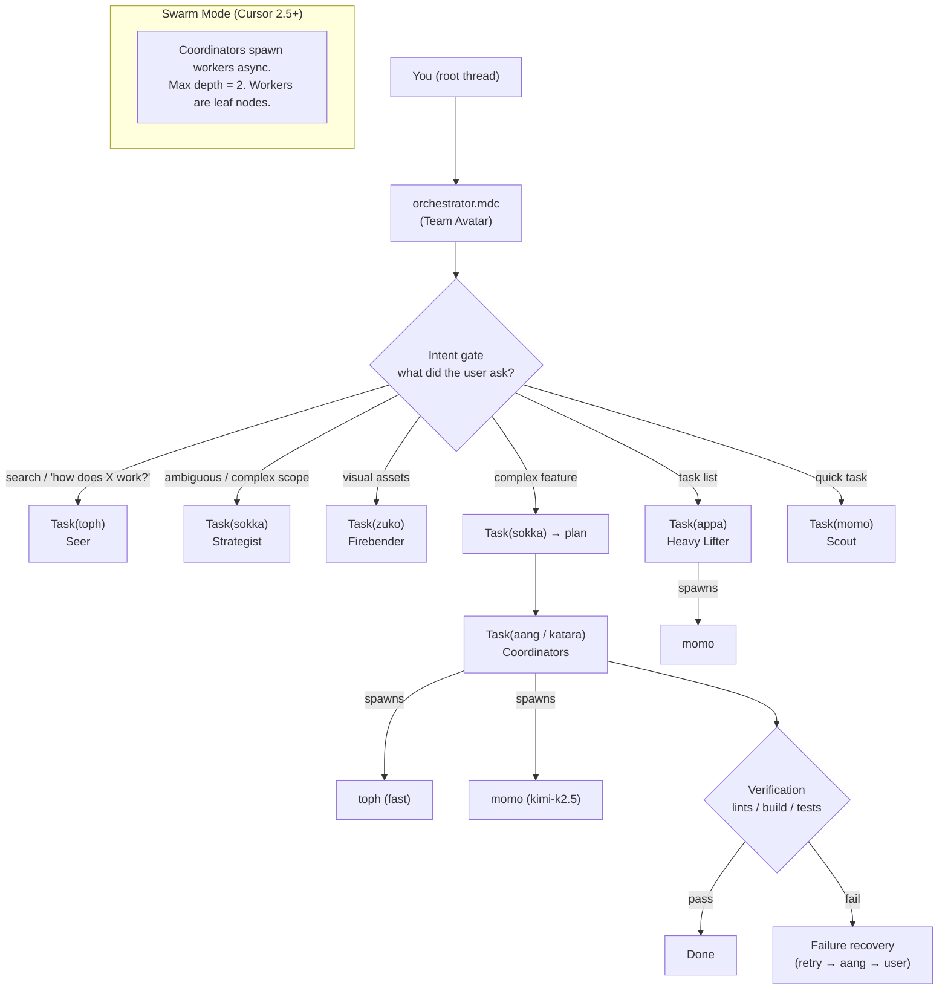

<p align="center">
  <a href="https://github.com/tmcfarlane/oh-my-cursor">
    
  </a>
</p>

<div align="center">

<div style="font-size: 2.2em; font-weight: 800; line-height: 1.15;">
  <strong>oh-my-cursor</strong> by <a href="https://zeroclickdev.ai/">ZeroClickDev</a>
</div>

Bringing the [32k-star oh-my-opencode](https://github.com/code-yeongyu/oh-my-opencode) to Cursor subagents.<br>
**Multi-agent orchestration, natively**, using nothing but config files.

<details>
<summary><strong>Cursor 2.5 — Released Feb 17th, 2026 — <span style="color: red;">TEAM AVATAR ACTIVATED!</span></strong><br>Updated to take advantage of new features and improvements.</summary>

<p align="center">
  <a href="https://cursor.com/changelog#async-subagents" style="display: flex; flex-direction: column; align-items: center;">
    <picture style="display: block;">
      <source srcset="screenshots/cursor_update_1.png" media="(prefers-color-scheme: dark)">
      <source srcset="screenshots/cursor_update_1.png" media="(prefers-color-scheme: light)">
      
    </picture>
    <picture style="display: block;">
      <source srcset="screenshots/cursor_update_2.png" media="(prefers-color-scheme: dark)">
      <source srcset="screenshots/cursor_update_2.png" media="(prefers-color-scheme: light)">
      
    </picture>
  </a>
</p>
</details>

</div>


## Quick Start (One Command)

```bash
curl -fsSL https://raw.githubusercontent.com/tmcfarlane/oh-my-cursor/main/install.sh | bash
```

## What Is This?

`oh-my-cursor` is a curated set of **8 agent manifests**, **7 slash commands**, **hooks**, and **one orchestration rule** -- themed around Avatar: The Last Airbender.

- **agents**: Team Avatar -- specialized roles mapped to ATLA characters (Aang, Sokka, Katara, Zuko, Toph, Appa, Momo, Iroh)
- **commands**: Slash commands (`/plan`, `/build`, `/search`, `/fix`, `/tasks`, `/scout`, `/cactus-juice`) for explicit orchestration control
- **hooks**: System-level lint verification and constraint enforcement
- **orchestrator**: A single rule (`orchestrator.mdc`) that coordinates everything -- "Team Avatar"

No external runtime. No wrapper CLI. **Just Cursor's built-in `Task` subagents.**


## How to Install

```bash
# [Default] Install to user scope (applies to all Cursor projects)
curl -fsSL https://raw.githubusercontent.com/tmcfarlane/oh-my-cursor/main/install.sh | bash

# Install to this project only (./.cursor/)
curl -fsSL https://raw.githubusercontent.com/tmcfarlane/oh-my-cursor/main/install.sh | bash -s -- --project

# Also install for Claude Code and Codex compatibility
curl -fsSL https://raw.githubusercontent.com/tmcfarlane/oh-my-cursor/main/install.sh | bash -s -- --claude --codex

# Preview changes
curl -fsSL https://raw.githubusercontent.com/tmcfarlane/oh-my-cursor/main/install.sh | bash -s -- --dry-run

# Update/overwrite existing files
curl -fsSL https://raw.githubusercontent.com/tmcfarlane/oh-my-cursor/main/install.sh | bash -s -- --force

# Uninstall
curl -fsSL https://raw.githubusercontent.com/tmcfarlane/oh-my-cursor/main/install.sh | bash -s -- --uninstall
```

### What Gets Installed

| Scope | Agents | Rules | Commands | Hooks |
|-------|--------|-------|----------|-------|
| `--user` (default) | `~/.cursor/agents/` | `~/.cursor/rules/` | `~/.cursor/commands/` | `~/.cursor/hooks/` |
| `--project` | `./.cursor/agents/` | `./.cursor/rules/` | `./.cursor/commands/` | `./.cursor/hooks/` |
| `--claude` | Also `.claude/agents/` | Also `.claude/rules/` | Also `.claude/commands/` | Also `.claude/hooks/` |
| `--codex` | Also `.codex/agents/` | Also `.codex/rules/` | Also `.codex/commands/` | Also `.codex/hooks/` |

### Upgrading from v0.1 (Greek Mythology)

The installer automatically detects and removes old agent files (hephaestus, prometheus, atlas, etc.) when installing the new Team Avatar agents.


## Team Avatar -- The Agents

| Agent | Character | Model | Role |
|-------|-----------|-------|------|
| **Aang** | The Avatar | `claude-4.6-sonnet` | Deep multi-file executor + architecture consultant. Masters all elements. |
| **Sokka** | The Strategist | `claude-4.6-opus` | Planning, ambiguity analysis, plan review. The brain behind every mission. |
| **Katara** | The Healer | `claude-4.6-sonnet` | Disciplined implementation, debugging, methodical fixes. Mends broken code. |
| **Zuko** | The Firebender | `gemini-3.1-pro` | Visual design: image generation, icons, UI mockups. Brings designs to life. |
| **Toph** | The Seer | `fast` | Codebase search, external docs, media analysis. Sees everything. |
| **Appa** | The Heavy Lifter | `kimi-k2.5` | Systematic task list execution. Carries the team. |
| **Momo** | The Scout | `kimi-k2.5` | Quick focused tasks. Small, agile, independent. |
| **Iroh** | The Storyteller | `fast` | Documentation specialist. Sole owner of README, CHANGELOG, and all project docs. |

### Model Tier Strategy

Each agent has a hardcoded model optimized for its role:

| Tier | Model | Used By | Rationale |
|------|-------|---------|-----------|
| Deep Reasoning | `claude-4.6-opus` | Sokka | Planning demands the deepest reasoning |
| Implementation | `claude-4.6-sonnet` | Aang, Katara | Strong code reasoning for complex tasks |
| Visual | `gemini-3.1-pro` | Zuko | Native multimodal generation for images and design |
| Cost-Effective | `kimi-k2.5` | Appa, Momo | Handles systematic and focused tasks efficiently |
| Speed | `fast` | Toph | Pure search, maximum speed |


## Slash Commands

Type these in Cursor's chat to invoke specific workflows:

| Command | Agent | Purpose |
|---------|-------|---------|
| `/plan` | Sokka | Full planning pipeline: ambiguity analysis, plan creation, self-review |
| `/build` | Aang | Deep multi-file implementation with verification |
| `/search` | Toph | Multi-angle codebase + docs exploration |
| `/fix` | Katara | Methodical debugging and code healing |
| `/tasks` | Appa | Systematic task list execution |
| `/scout` | Momo | Quick focused tasks |
| `/cactus-juice` | Swarm | Decompose into micro-tasks, spawn up to 10 parallel workers |


## Two Orchestration Modes

### Avatar State (Default)

The default mode. Coordinated, tiered, using the full Team Avatar hierarchy with model-optimized agents. The orchestrator rule auto-detects which agents to fire based on request signals.

### Cactus Juice Mode

Activated via `/cactus-juice`. Named after the desert cactus juice that made Sokka hallucinate -- "It's the quenchiest!"

This mode trades depth for massive parallelism:

1. The root thread decomposes your request into 5-10 **independent micro-tasks**
2. Each micro-task is scoped to a single file -- completable in isolation
3. Up to **10 subagents spawn simultaneously**, each with minimal context
4. All workers use `model: fast` for maximum speed and minimum cost
5. Workers are instructed to write **low cognitive complexity** code
6. Root thread collects results, verifies consistency, fixes integration issues


## Architecture




## Async Subagents (Cursor 2.5+)

This project implements a **two-tier swarm architecture** using Cursor's native async subagent support:

- **Coordinators** (Tier 1): Aang, Sokka, Katara, Appa -- can spawn worker subagents
- **Workers** (Tier 2): Toph, Momo -- leaf nodes that execute focused tasks
- **Root-only workers**: Zuko -- dispatched only by the root thread

**Three async dispatch patterns:**

| Pattern | How It Works |
|---------|-------------|
| **Fire-and-Continue** | Spawn Toph in background (`is_background: true`), continue working, collect results later |
| **Fire-and-Collect** | Spawn multiple Momo workers for independent tasks, wait for all, verify each |
| **Research-then-Act** | Spawn Toph workers in parallel for research, use findings to guide implementation |


## Hooks

System-level enforcement that doesn't rely on agents remembering to verify:

| Hook | Purpose |
|------|---------|
| `post-edit-lint.sh` | Automatically run lints after agent edits |
| `pre-commit-check.sh` | Enforce hard constraints (`as any`, empty catches, `@ts-ignore`) before commits |


## Prompting Tips

The orchestrator rule handles auto-delegation, but for maximum determinism:

```text
You are Team Avatar. Use @toph to explore the codebase, @sokka to create a plan,
and @aang to implement. Verify with lints/build/tests. Keep going until done.
```

Or just use the slash commands:

```text
/plan add OAuth support with JWT tokens
/build based on the plan above
```


## Skills

Skills are directories containing `SKILL.md` files that Cursor auto-discovers and presents to all agents as specialized context. They extend agents with domain knowledge without modifying agent prompts directly.

### Default skill set

| Skill | Source | Agents that use it | What it provides |
|---|---|---|---|
| `react-best-practices` | vercel-labs/agent-skills | Aang, Sokka, Katara, Appa, Momo | React & Next.js performance patterns |
| `composition-patterns` | vercel-labs/agent-skills | Aang, Sokka, Katara, Appa | Component architecture guidelines |
| `web-design-guidelines` | vercel-labs/agent-skills | Aang, Zuko | UI/UX audit rules and design standards |
| `find-skills` | vercel-labs/skills | Toph | Discovers and installs new skills |

### Installing skills

**With the install script** (requires Node.js/npx):

```bash
bash install.sh --with-skills           # user-scoped agents + rules + skills
bash install.sh --with-skills --project # project-scoped everything
```

**Manually** using the `npx skills` CLI:

```bash
npx skills add vercel-labs/agent-skills --skill react-best-practices
npx skills add vercel-labs/agent-skills --skill composition-patterns
npx skills add vercel-labs/agent-skills --skill web-design-guidelines
npx skills add vercel-labs/skills --skill find-skills
```

### Discovering new skills

Ask Toph — or run `npx skills find [query]` to search the registry.

### Adding custom skills

Create a directory with a `SKILL.md` file and place it under `.cursor/skills/` (project-scoped) or `~/.cursor/skills/` (user-scoped). Cursor will auto-discover it.

The `skills.json` file at the repo root declares which skills oh-my-cursor recommends. Optional skills (e.g. `react-native-skills`) are listed there but not installed by default.

## FAQ

#### Do I need to manually choose agents?

Not strictly -- the orchestrator auto-triggers delegation based on request signals. But slash commands (`/plan`, `/build`, `/fix`, etc.) give you explicit control.

#### Will this work on any Cursor plan?

If your plan supports agent mode / subagents, yes. These files shape Cursor's existing capabilities.

#### How do I update?

```bash
curl -fsSL https://raw.githubusercontent.com/tmcfarlane/oh-my-cursor/main/install.sh | bash -s -- --force
```

#### How do I uninstall?

```bash
curl -fsSL https://raw.githubusercontent.com/tmcfarlane/oh-my-cursor/main/install.sh | bash -s -- --uninstall
```

#### Can I use this with Claude Code or Codex?

Yes! Install with cross-tool flags:

```bash
curl -fsSL https://raw.githubusercontent.com/tmcfarlane/oh-my-cursor/main/install.sh | bash -s -- --claude --codex
```


## Screenshots

**1. Prompt** -- Subagents and Phase 1 exploration


**2. Orchestration phases** -- Phase breakdown diagram


**3. Phase 1** -- Codebase Assessment


**4. Phase 2** -- Agent Dispatch


**5. Phase final** -- Phase 5 complete, final build status


---

## The Origin Story (aka: Token Optimization for Degenerates)

I upgraded my Cursor account to Ultra right before my usage was going to roll over.

Then I realized I had **9 days** to burn roughly **$300 worth of tokens** to truly min/max the subscription rollover period.

So I did what any natural-born crayon eating ape would do:

- I tried overengineering around CursorCLI
- I decided it wasn't ready for the kind of nonsense I had planned
- I jumped back into the UI
- I realized I could basically clone the methodology behind **oh-my-opencode**
- and that **all it takes** is dropping some files into Cursor config + one prioritised orchestration rule

Result: **oh-my-cursor Agent Swarms** that do real work and also help you responsibly (irresponsibly) "optimize" your token burn.


---

## License

MIT. See [LICENSE](LICENSE).

## Inspiration

**[oh-my-opencode](https://github.com/code-yeongyu/oh-my-opencode)** is the 32k+ star project that turned OpenCode into a multi-agent orchestration platform -- so impactful that **Anthropic cited it by name** when restricting third-party OAuth access in January 2026. This repo adapts its philosophy (agent specialization, parallel dispatch, phased orchestration, todo enforcement) to Cursor's native `Task` subagents. No plugin system, no wrapper CLI -- just Markdown config files.

## Star History

[](https://www.star-history.com/#tmcfarlane/oh-my-cursor&type=date&legend=top-left)
