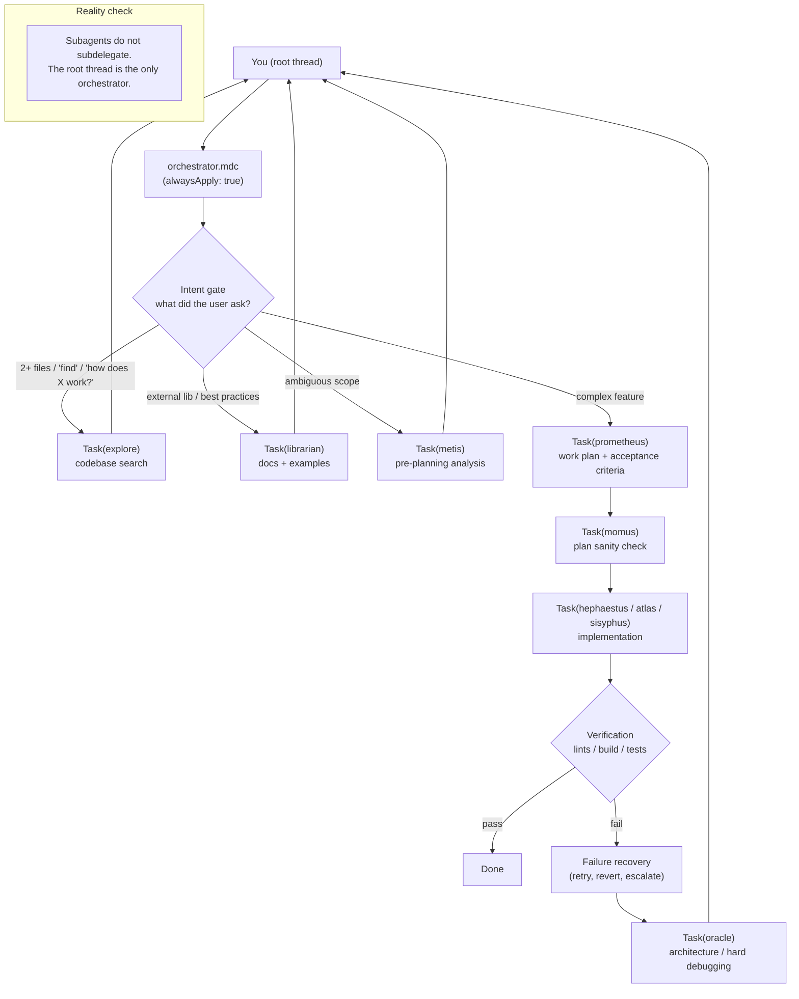

<p align="center">
  <a href="https://github.com/tmcfarlane/oh-my-cursor">
    <picture>
      <source srcset="screenshots/prompt.png" media="(prefers-color-scheme: dark)">
      <source srcset="screenshots/prompt.png" media="(prefers-color-scheme: light)">
      
    </picture>
  </a>
</p>

<div align="center">

### **oh-my-cursor** by [ZeroClickDev](https://zeroclickdev.ai/)

Like “oh-my-opencode”, but for Cursor(IDE)<br>
**Multi-agent orchestration, natively**, using nothing but a few config files.

</div>

## Quick Start (One Command)

Install to **user scope** (applies to all Cursor projects):

```bash
curl -fsSL https://raw.githubusercontent.com/tmcfarlane/oh-my-cursor/main/install.sh | bash
```

## What Is This?

`oh-my-cursor` is a curated set of Cursor agent manifests plus **one** always-on orchestration rule:

- **agents**: specialized roles (explore, librarian, planner, executor, reviewer…)
- **orchestrator**: a single rule (`orchestrator.mdc`) that tells the root thread **when** to delegate, **who** to delegate to, and **how** to verify results

No external runtime. No wrapper CLI. **Just Cursor’s built-in `Task` subagents** (this capability landed in January and makes this whole setup surprisingly clean).


## The Origin Story (aka: Token Optimization for Degenerates)

I upgraded my Cursor account to Ultra right before my usage was going to roll over.

Then I realized I had **9 days** to burn roughly **$300 worth of tokens** to truly min/max the subscription rollover period.

So I did what any natural-born crayon eating ape would do:

- I tried overengineering around CursorCLI
- I decided it wasn’t ready for the kind of nonsense I had planned
- I jumped back into the UI
- I realized I could basically clone the methodology behind **oh-my-opencode**
- and that **all it takes** is dropping some files into Cursor config + one prioritised orchestration rule

Result: **oh-my-cursor Agent Swarms** (not really swarms) that do real work and also help you responsibly (irresponsibly) “optimize” your token burn.

## How to Install
```bash
# Install to user scope (applies to all Cursor projects)
curl -fsSL https://raw.githubusercontent.com/tmcfarlane/oh-my-cursor/main/install.sh | bash

# Install to this project only (./.cursor/)
curl -fsSL https://raw.githubusercontent.com/tmcfarlane/oh-my-cursor/main/install.sh | bash -s -- --project

# Preview changes
curl -fsSL https://raw.githubusercontent.com/tmcfarlane/oh-my-cursor/main/install.sh | bash -s -- --dry-run

# Update/overwrite existing files
curl -fsSL https://raw.githubusercontent.com/tmcfarlane/oh-my-cursor/main/install.sh | bash -s -- --force

# Uninstall
curl -fsSL https://raw.githubusercontent.com/tmcfarlane/oh-my-cursor/main/install.sh | bash -s -- --uninstall
```

### What Gets Installed

| Scope | Agents | Rules |
|------|--------|-------|
| `--user` (default) | `~/.cursor/agents/` | `~/.cursor/rules/orchestrator.mdc` |
| `--project` | `./.cursor/agents/` | `./.cursor/rules/orchestrator.mdc` |

<span style="color: red;">***Rule Priority (Important)***</span>

If you have multiple Cursor rules, make sure `orchestrator.mdc` is **enabled** and **high priority** (so it’s applied early and consistently). If your rules UI supports ordering, move it up; if you rely on naming, prefixing it (e.g. `000-orchestrator.mdc`) works well.


## Prompting Tips (Most Effective Pattern)

The orchestrator rule does a great job on its own, but I’ve found it’s still most effective to:

- **tag agents in the starting prompt**, and
- explicitly tell the model to **orchestrate among them**

Example:

```text
You are the orchestrator. Use @explore to map the codebase, @prometheus to draft a plan, @momus to review it,
and @hephaestus/@atlas to implement. Verify with lints/build/tests. Keep going until done.
```


## Agents Included

You get a cast of specialists (all just Markdown manifests):

| Agent | Role |
|------|------|
| `explore` | Codebase search & pattern discovery |
| `librarian` | External docs + OSS examples |
| `prometheus` | Planning |
| `momus` | Plan review (blocking issues only) |
| `hephaestus` | Deep multi-file implementation |
| `atlas` | Step-by-step executor with obsessive verification |
| `sisyphus` | Disciplined multi-step execution + codebase assessment |
| `oracle` | Architecture / hard debugging |
| `generalPurpose` | Focused single-domain work |
| `metis` | Ambiguity / intent analysis |
| `multimodal-looker` | PDFs/images/diagrams |


## Downsides / Current Limitations (Honest Section)

- **Not a real swarm**: subagents can’t subdelegate. They’re leaf nodes by design.
- **Same model everywhere**: subagents inherit the same model/mode as the root thread (so if you’re running “Opus 4.5 Max Mode (now 4.6)”, they’re all on that too).
- **Skills aren’t scoped per agent**: it’d be fantastic if subagents could see a curated subset of skills instead of “all or nothing”.

>If Cursor ever adds per-agent model selection + skill scoping, this repo gets even more powerful overnight!!!


## Screenshots

**1. Prompt** — Subagents and Phase 1 exploration


**2. Orchestration phases** — Phase breakdown diagram


**3. Phase 1** — Codebase Assessment


**4. Phase 2** — Agent Dispatch


**5. Phase final** — Phase 5 complete, final build status


## How The “Swarm” Works (Mermaid Diagram)

Subagents are **leaf nodes**: they can search, plan, implement, review — but they **cannot** spawn more agents. The “swarm” is the root thread orchestrating them.




## FAQ

#### Do I need to manually choose agents?

Not strictly — the orchestrator can auto-trigger delegation — but it’s often best to **explicitly tag agents** in your first prompt for maximum determinism.

#### Will this work on any Cursor plan?

If your plan supports agent mode / subagents, yes. These files don’t “add” capabilities; they **shape** the capabilities Cursor already has.

#### How do I update?

Re-run the installer with `--force`:

```bash
curl -fsSL https://raw.githubusercontent.com/tmcfarlane/oh-my-cursor/main/install.sh | bash -s -- --force
```

#### How do I uninstall?

```bash
curl -fsSL https://raw.githubusercontent.com/tmcfarlane/oh-my-cursor/main/install.sh | bash -s -- --uninstall
```

---

## Inspiration

- **[oh-my-opencode](https://github.com/code-yeongyu/oh-my-opencode)** — the original inspiration. This repo adapts the “multi-agent philosophy” to Cursor’s native subagent system.

---

## License

MIT. See [LICENSE](LICENSE).
