<div align="center">

<div style="font-size: 2.0em; font-weight: 800; line-height: 1.1;">
  <strong>oh-my-cursor</strong>
</div>

<div style="font-size: 0.85em; font-weight: 400; letter-spacing: 0.25em; text-transform: uppercase; margin: 4px 0;">presents</div>

<p align="center">
  <a href="https://github.com/tmcfarlane/oh-my-cursor">
    
  </a>
</p>
<div style="font-size: 2.5em; font-weight: 700; letter-spacing: 0.12em;">
  <strong>TEAM AVATAR</strong>
</div>

**An Avatar-themed AI dev team for Cursor.** 8 specialist agents, real per-model routing,<br>
and hooks that block bad commits — pure config files, no runtime, no wrapper CLI.<br>
_Created by <a href="https://zeroclickdev.ai/">ZeroClickDev</a>_

[](LICENSE)
[](https://github.com/tmcfarlane/oh-my-cursor/stargazers)
[](VALIDATION.md)
<br>

</div>

> **v0.4.1 — Hardening** (June 28, 2026, validated on **Cursor 3.9.8**: 13/15 → 15/15): a git
> `pre-commit` backstop catches `as any`/`@ts-ignore` commits even when the agent commits via
> Cursor's **native git path** (which bypasses the shell hook), and credential-file reads
> (`~/.ssh`, `~/.aws`, `*.pem`, …) are now **held** deterministically. See [`CHANGELOG`](CHANGELOG.md).
>
> **v0.4.0 — Enforcement + Automation** (June 26, 2026, validated live on Cursor 3.8.23):
> [hooks](#hooks-cursor-agent-loop) that **block** an agent's destructive commands and
> `as any`/`@ts-ignore` commits · an [auto-review policy](#auto-review-policy-permissionsjson)
> that holds risky calls (~84% fewer prompts) · paste-in [`/automate` recipes](automations/README.md) ·
> Windows parity. See the [validated reference](VALIDATION.md) · [contributions welcome](CONTRIBUTING.md).

## Quick Start (One Command)

**macOS / Linux:**

```bash
curl -fsSL https://raw.githubusercontent.com/tmcfarlane/oh-my-cursor/main/install.sh | bash
```

**Windows (PowerShell):**

```powershell
irm https://raw.githubusercontent.com/tmcfarlane/oh-my-cursor/main/install.ps1 | iex
```

## What Is This?

**8 agent manifests, 8 slash commands, hooks, and one orchestration rule** — themed around Avatar: The Last Airbender. No external runtime, no wrapper CLI — just Cursor's built-in `Task` subagents and Markdown config files.

> Each agent routes to its own model via Cursor's `model:` field ([per-agent routing](#per-agent-model-routing)). The catch: an invalid slug **silently downgrades** instead of erroring — so every slug here is verified against a real build ([VALIDATION.md](VALIDATION.md)).

## Contents

- [Quick Start](#quick-start-one-command)
- [What Is This?](#what-is-this)
- [Agents](#team-avatar----the-agents)
- [How to Install](#how-to-install)
- [Slash Commands](#slash-commands)
- [Orchestration Modes](#two-orchestration-modes)
- [Architecture](#architecture)
- [Skills](#skills)
- [FAQ](#faq)
- [Contributing](#contributing)
- [License](#license)

## The Orchestrator

The orchestrator rule (`orchestrator.mdc`) rewires how the root thread thinks. The root becomes a **pure dispatcher** — its only permitted tools are `Task`, `TodoWrite`, `AskQuestion`, and `SwitchMode`. All work flows through specialist agents.

Here's a real example of the root thread's internal reasoning:

> **Planning Installation Instructions**
>
> I need to follow the orchestrator's guidance, since the root can't use Read directly and must delegate via Task. I have to document this in the README and use iroh, but I'm unsure about the new installation instructions, which might be documented elsewhere. It's critical to know these details, so I could search the repository with iroh/toph for existing install docs. I'll have to organize a plan: dispatch toph to find the installation instructions and have iroh update the README after. Plus, I'll create a to-do list to keep track of everything.

Every sentence maps to an orchestrator rule: agent routing (Iroh for docs, Toph for search), phase chaining (explore → write), and mandatory task tracking via `TodoWrite`.

## Team Avatar -- The Agents

Eight specialized agents, each mapped to an Avatar character with a dedicated model and role. Expand any agent for skills and working screenshots.

<p align="center">
  <a href="#agent-aang"></a>&nbsp;&nbsp;
  <a href="#agent-sokka"></a>&nbsp;&nbsp;
  <a href="#agent-katara"></a>&nbsp;&nbsp;
  <a href="#agent-zuko"></a>&nbsp;&nbsp;
  <a href="#agent-toph"></a>&nbsp;&nbsp;
  <a href="#agent-appa"></a>&nbsp;&nbsp;
  <a href="#agent-momo"></a>&nbsp;&nbsp;
  <a href="#agent-iroh"></a>
</p>

<a id="agent-aang"></a>

<details open>
<summary> <strong>Aang</strong> — <em>The Avatar</em> · <code>composer-2.5-fast</code></summary>

Deep multi-file executor + architecture consultant. Masters all elements.

> **Master of all four elements** — Multi-agent orchestration in action

Skills: [`design-patterns-implementation`](skills/design-patterns-implementation/SKILL.md) · [`refactoring-patterns`](skills/refactoring-patterns/SKILL.md) · [`vercel-react-best-practices`](skills/vercel-react-best-practices/SKILL.md)

<p align="center"><a href="screenshots/teamavatar/aang.png">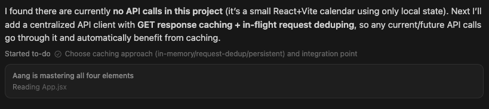</a></p>

</details>

<a id="agent-sokka"></a>

<details open>
<summary> <strong>Sokka</strong> — <em>The Strategist</em> · <code>claude-opus-4-8-thinking-high</code></summary>

Planning, ambiguity analysis, plan review. The brain behind every mission.

> **Ask First, Dispatch Second** — The orchestrator clarifies before sending agents

Skills: [`architect`](skills/architect/SKILL.md) · [`planning`](skills/planning/SKILL.md) · [`technical-roadmap-planning`](skills/technical-roadmap-planning/SKILL.md)

<p align="center"><a href="screenshots/teamavatar/sokka.png">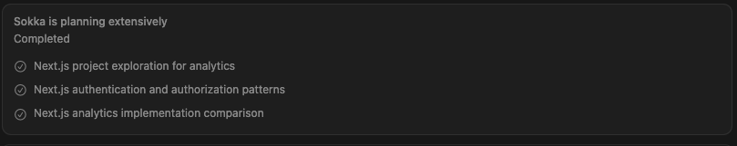</a></p>

</details>

<a id="agent-katara"></a>

<details open>
<summary> <strong>Katara</strong> — <em>The Healer</em> · <code>composer-2.5-fast</code></summary>

Disciplined implementation, debugging, methodical fixes. Mends broken code.

> **Precision Healer** — Surgical debugging, smallest possible fix

Skills: [`debugging`](skills/debugging/SKILL.md) · [`refactoring`](skills/refactoring/SKILL.md) · [`refactoring-patterns`](skills/refactoring-patterns/SKILL.md)

<p align="center"><a href="screenshots/teamavatar/katara.png">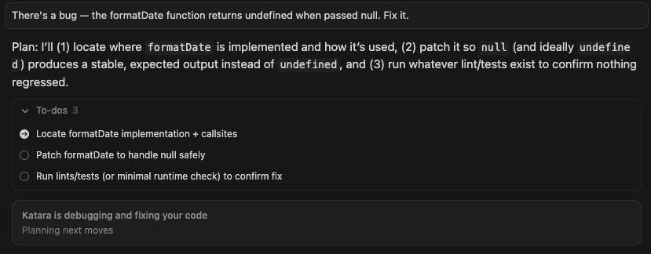</a></p>

</details>

<a id="agent-zuko"></a>

<details open>
<summary> <strong>Zuko</strong> — <em>The Firebender</em> · <code>gemini-3.1-pro</code></summary>

Visual design: image generation, icons, UI mockups. Brings designs to life.

> **Fire and Finesse** — Image generation, icons, and UI mockups

Skills: [`create-an-asset`](skills/create-an-asset/SKILL.md) · [`implementing-figma-designs`](skills/implementing-figma-designs/SKILL.md) · [`web-design-guidelines`](skills/web-design-guidelines/SKILL.md)

<p align="center"><a href="screenshots/teamavatar/zuko.png">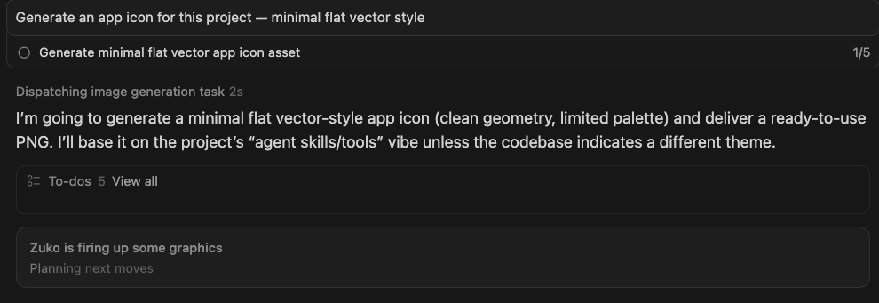</a></p>

</details>

<a id="agent-toph"></a>

<details>
<summary> <strong>Toph</strong> — <em>The Seer</em> · <code>composer-2.5-fast</code></summary>

Codebase search, external docs, media analysis. Sees everything.

> **Seismic Sense** — Multi-angle codebase search and doc exploration

Skills: [`codebase-search`](skills/codebase-search/SKILL.md) · [`exploring-codebases`](skills/exploring-codebases/SKILL.md) · [`mgrep-code-search`](skills/mgrep-code-search/SKILL.md)

<p align="center"><a href="screenshots/teamavatar/toph.png">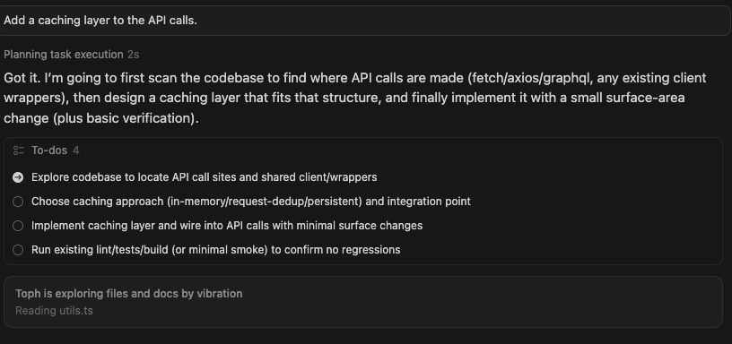</a></p>

</details>

<a id="agent-appa"></a>

<details>
<summary> <strong>Appa</strong> — <em>The Heavy Lifter</em> · <code>composer-2.5-fast</code></summary>

Systematic task list execution. Carries the team.

> **Plan Executor** — Systematic task list execution, one step at a time

Skills: [`frontend-builder`](skills/frontend-builder/SKILL.md) · [`vercel-composition-patterns`](skills/vercel-composition-patterns/SKILL.md) · [`vercel-react-best-practices`](skills/vercel-react-best-practices/SKILL.md)

<p align="center"><a href="screenshots/teamavatar/appa.png">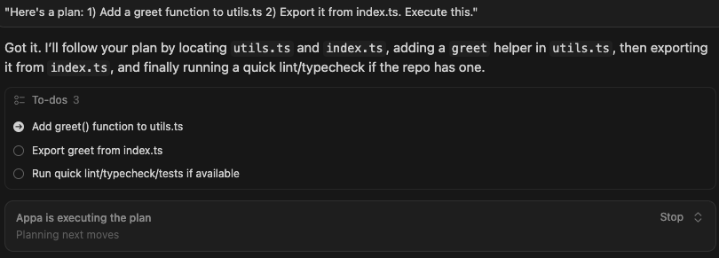</a></p>

</details>

<a id="agent-momo"></a>

<details>
<summary> <strong>Momo</strong> — <em>The Scout</em> · <code>composer-2.5-fast</code></summary>

Quick focused tasks. Small, agile, independent.

> **Speed Demon** — Parallel micro-tasks, maximum speed

Skills: [`refactoring`](skills/refactoring/SKILL.md) · [`refactoring-patterns`](skills/refactoring-patterns/SKILL.md) · [`vercel-react-best-practices`](skills/vercel-react-best-practices/SKILL.md)

<p align="center"><a href="screenshots/teamavatar/momo.png">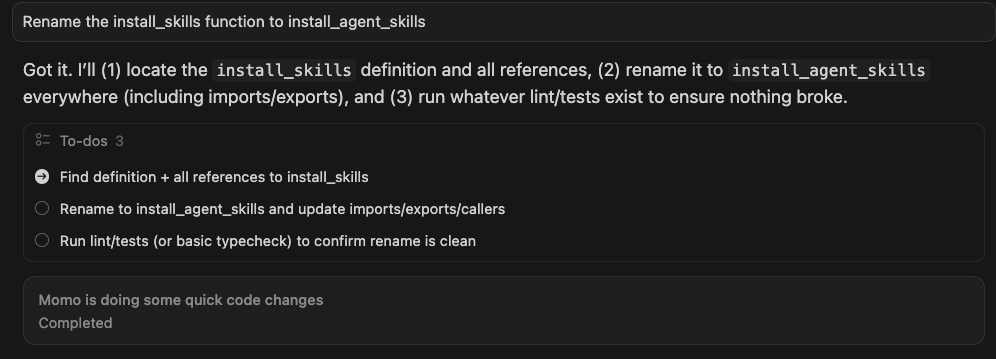</a></p>

</details>

<a id="agent-iroh"></a>

<details>
<summary> <strong>Iroh</strong> — <em>The Storyteller</em> · <code>claude-opus-4-8-thinking-high</code></summary>

Documentation specialist. Sole owner of README, CHANGELOG, and all project docs.

> **Man of his letters** — Iroh spends much of his time writing letters to family.

Skills: [`crafting-effective-readmes`](skills/crafting-effective-readmes/SKILL.md) · [`docs-write`](skills/docs-write/SKILL.md) · [`documentation-engineer`](skills/documentation-engineer/SKILL.md) · [`documentation-writing`](skills/documentation-writing/SKILL.md)

<p align="center"><a href="screenshots/teamavatar/iroh.png">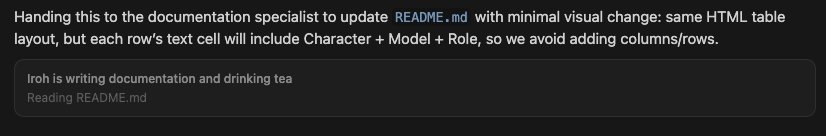</a></p>

</details>

## Model Policy

Default model: **Composer 2.5** (`composer-2.5-fast`). See Cursor model docs for current availability and routing behavior. Higher speed, uses Cursor’s Auto + Composer pool. ([#20](https://github.com/tmcfarlane/oh-my-cursor/issues/20), [#21](https://github.com/tmcfarlane/oh-my-cursor/issues/21))

**Exceptions:**

| Agent     | Model                          | Reason                                 |
| --------- | ------------------------------ | -------------------------------------- |
| **Sokka** | `claude-opus-4-8-thinking-high` | Maximum reasoning for complex planning |
| **Iroh**  | `claude-opus-4-8-thinking-high` | Long-form documentation quality        |
| **Zuko**  | `gemini-3.1-pro`             | Multimodal / visual stack              |

Coordinator-spawned workers may use Cursor’s `fast` tier or inherit the coordinator’s model. If a workflow regresses on Composer 2.5, change `model:` in the agent’s markdown file.

## How to Install

**Requirements:** [Cursor](https://www.cursor.com/) **3.4+** with agent mode (subagents). No external runtime.

### macOS / Linux

```bash
curl -fsSL https://raw.githubusercontent.com/tmcfarlane/oh-my-cursor/main/install.sh | bash
```

<details>
<summary>More options</summary>

```bash
bash -s -- --project     # Install to this project only (./.cursor/)
bash -s -- --claude --codex  # Also install for Claude Code and Codex
bash -s -- --no-skills   # Skip skills installation
bash -s -- --dry-run     # Preview changes
bash -s -- --force       # Update/overwrite existing files
bash -s -- --uninstall   # Uninstall
bash -s -- --disable     # Disable orchestration (agents stay)
bash -s -- --enable      # Re-enable orchestration
```

Append these flags to the `curl ... | bash` one-liner above. Hacking locally? Clone the repo, then run `bash install.sh`.

</details>

### Windows (PowerShell)

```powershell
irm https://raw.githubusercontent.com/tmcfarlane/oh-my-cursor/main/install.ps1 | iex
```

<details>
<summary>More options</summary>

```powershell
# PowerShell 7+ / Windows 11 one-liner with flags:
& ([scriptblock]::Create((irm https://raw.githubusercontent.com/tmcfarlane/oh-my-cursor/main/install.ps1))) -Scope project -Force

# Or clone and run locally (all versions):
git clone https://github.com/tmcfarlane/oh-my-cursor.git && cd oh-my-cursor
.\install.ps1                    # Default (user scope)
.\install.ps1 -Scope project    # Project scope
.\install.ps1 -AlsoClaude -AlsoCodex  # Cross-tool compat
.\install.ps1 -NoSkills         # Skip skills
.\install.ps1 -Force            # Overwrite
.\install.ps1 -Uninstall        # Remove
```

> On Windows PowerShell 5.1, `irm | iex` only supports default install. For flags, clone the repo.

</details>

### What Gets Installed

| Scope              | Agents                 | Rules                 | Commands                 | Hooks                 | Skills              |
| ------------------ | ---------------------- | --------------------- | ------------------------ | --------------------- | ------------------- |
| `--user` (default) | `~/.cursor/agents/`    | `~/.cursor/rules/`    | `~/.cursor/commands/`    | `~/.cursor/hooks/`    | `~/.cursor/skills/` |
| `--project`        | `./.cursor/agents/`    | `./.cursor/rules/`    | `./.cursor/commands/`    | `./.cursor/hooks/`    | `./.cursor/skills/` |
| `--claude`         | Also `.claude/agents/` | Also `.claude/rules/` | Also `.claude/commands/` | Also `.claude/hooks/` | —                   |
| `--codex`          | Also `.codex/agents/`  | Also `.codex/rules/`  | Also `.codex/commands/`  | Also `.codex/hooks/`  | —                   |
| `--no-skills`      | ✓                      | ✓                     | ✓                        | ✓                     | Skipped             |

> **First-time rule activation:** Cursor may require you to approve the orchestrator rule. Open `~/.cursor/rules/orchestrator.mdc` and click **"Always Allow"** when prompted (one-time step).

> **Upgrading from v0.1:** The installer auto-removes old agent files (hephaestus, prometheus, atlas, etc.).

### Per-Agent Model Routing

<p align="center">
  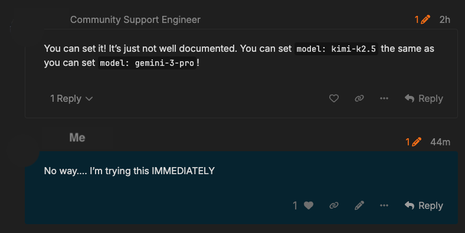
</p>

Cursor’s `model:` field in agent frontmatter routes each agent to a specific model ([Cursor docs](https://cursor.com/docs/subagents)). It must be an **exact, valid Cursor Task-tool slug** — it does **not** accept arbitrary alias strings:

```yaml
---
model: composer-2.5-fast # fast executor pool
---
```

```yaml
---
model: gemini-3.1-pro # multimodal tasks
---
```

> ⚠️ **An unrecognized slug does not error — it silently falls back to `composer-2.5-fast`.** A typo or stale name looks like it "works" while quietly running the wrong model. Always use a verified slug and confirm routing (see [`VALIDATION.md`](VALIDATION.md)). Omitting `model:` makes a subagent inherit its parent's model.

**Valid slugs (Cursor 3.8.x, verified June 2026):** `composer-2.5-fast`, `claude-opus-4-8-thinking-high`, `gemini-3.1-pro`, `claude-4.6-opus-high-thinking`, `claude-4.6-sonnet-medium-thinking`, `claude-fable-5-thinking-high`, `gpt-5.3-codex-high-fast`, `gpt-5.5-medium`, `kimi-k2.5`.

> **Slugs change between Cursor versions, and the docs don't list the gotcha.** Re-verify against your build before relying on routing — the [VALIDATION.md](VALIDATION.md) sweep makes it a 2-minute check.

## Slash Commands

Type these in Cursor's chat to invoke specific workflows:

| Command         | Agent  | Purpose                                                                                                  |
| --------------- | ------ | -------------------------------------------------------------------------------------------------------- |
| `/plan`         | Sokka  | Full planning pipeline: ambiguity analysis, plan creation, self-review                                   |
| `/build`        | Aang   | Deep multi-file implementation with verification                                                         |
| `/search`       | Toph   | Multi-angle codebase + docs exploration                                                                  |
| `/fix`          | Katara | Methodical debugging and code healing                                                                    |
| `/tasks`        | Appa   | Systematic task list execution                                                                           |
| `/scout`        | Momo   | Quick focused tasks                                                                                      |
| `/doc`          | Iroh   | Documentation generation and updates                                                                     |
| `/image`        | Zuko   | Cursor image generation (Nano Banana Pro): icons, mockups, prompts via **cursor-image-generation** skill |
| `/cactus-juice` | Swarm  | Decompose into micro-tasks, spawn up to 10 parallel workers                                              |

### Image generation (Cursor agent)

The agent can generate images via **Google Nano Banana Pro**; previews save under **`assets/`** by default. Team Avatar routes visual generation to **Zuko**, which uses the **`cursor-image-generation`** skill ([`skills/cursor-image-generation/SKILL.md`](skills/cursor-image-generation/SKILL.md)) to **rewrite** short user requests into full prompts, then iterate. Use **`/image`** or delegate **`Task(zuko)`** for image-only work.

## Two Orchestration Modes

### Avatar State (Default)

Coordinated, tiered orchestration. The orchestrator auto-detects which agents to dispatch based on request signals.

### Cactus Juice Mode

<p align="left">
  
</p>

Activated via `/cactus-juice`. Trades depth for massive parallelism:

1. Root decomposes your request into 5–10 **independent micro-tasks** (single-file scope)
2. Up to **10 subagents spawn simultaneously** using `model: fast`
3. Workers write **low cognitive complexity** code
4. Root collects results, verifies consistency, fixes integration issues

<p align="left">
  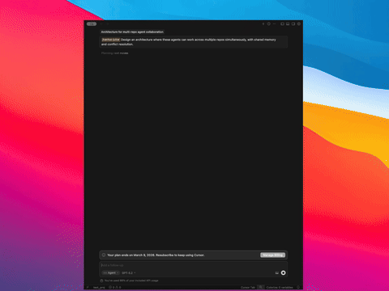
</p>

## Architecture

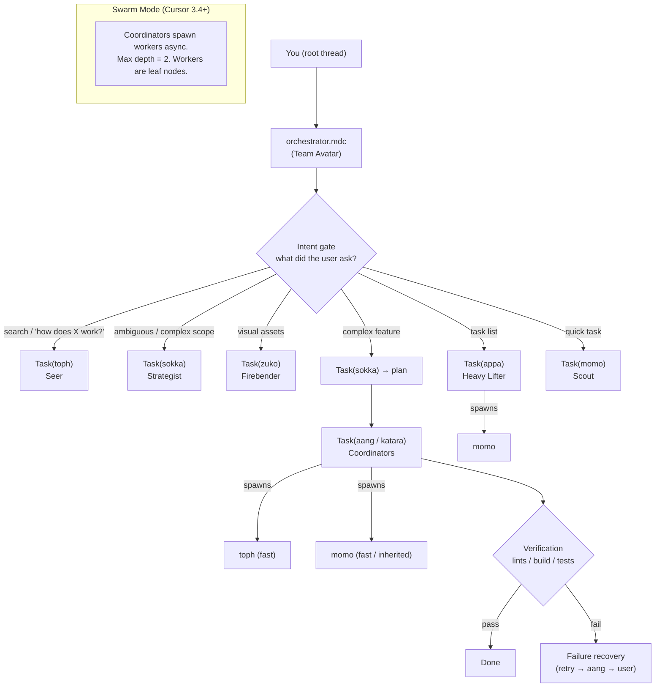
```mermaid
flowchart TD
  U["You (root thread)"] --> R["orchestrator.mdc<br/>(Team Avatar)"]

  R --> IG{"Intent gate<br/>what did the user ask?"}

  IG -->|"search / 'how does X work?'"| T["Task(toph)<br/>Seer"]
  IG -->|"ambiguous / complex scope"| S["Task(sokka)<br/>Strategist"]
  IG -->|"visual assets"| Z["Task(zuko)<br/>Firebender"]

  IG -->|"complex feature"| PLAN["Task(sokka) → plan"]
  PLAN --> IMPL["Task(aang / katara)<br/>Coordinators"]

  IMPL -->|"spawns"| T2["toph (fast)"]
  IMPL -->|"spawns"| M2["momo (fast / inherited)"]

  IG -->|"task list"| AP["Task(appa)<br/>Heavy Lifter"]
  AP -->|"spawns"| M3["momo"]

  IG -->|"quick task"| MO["Task(momo)<br/>Scout"]

  IMPL --> V{"Verification<br/>lints / build / tests"}
  V -->|pass| DONE["Done"]
  V -->|fail| FR["Failure recovery<br/>(retry → aang → user)"]

  subgraph swarmNote ["Swarm Mode (Cursor 3.4+)"]
    N1["Coordinators spawn workers async.<br/>Max depth = 2. Workers are leaf nodes."]
  end
```

## Async Subagents (Cursor 3.4+)

Two-tier swarm: **Coordinators** (Aang, Sokka, Katara, Appa) spawn **Workers** (Toph, Momo) as leaf nodes. Zuko is root-only.

| Pattern               | How It Works                                                        |
| --------------------- | ------------------------------------------------------------------- |
| **Research-then-Act** | Spawn Toph for parallel research, collect results, then implement   |
| **Fire-and-Collect**  | Spawn multiple Momo workers, wait for all, verify each              |

## Hooks (Cursor agent-loop)

System-level enforcement that doesn't rely on agents remembering to verify. Wired through
Cursor's [hooks](https://cursor.com/docs/hooks) system via **`.cursor/hooks.json`** — each
hook is a script that receives a JSON payload on stdin and (for `beforeShellExecution`)
returns an allow/deny/ask decision.

> **Hooks are project-scoped.** Install them with **`install.sh --project`** inside a repo;
> hook command paths are relative to the workspace root, so a user-scope (`~/.cursor`) install
> deliberately skips the hook config. After installing, **fully restart Cursor (Cmd+Q)** —
> a window reload is not enough to register project hooks — and ensure the workspace is trusted.

| Hook handler          | Event                  | Purpose                                                                         |
| --------------------- | ---------------------- | ------------------------------------------------------------------------------- |
| `guard-shell.sh`      | `beforeShellExecution` | **Blocks** destructive commands (`rm -rf /`, force-push to `main`, hard reset of shared branches) and commits containing forbidden anti-patterns (`as any`, `@ts-ignore`, empty catches) |
| `post-edit-lint.sh`   | `afterFileEdit`        | Runs lints on the edited file (informational — surfaces issues immediately)     |
| `pre-commit-check.sh` | (library)              | Anti-pattern checker invoked by `guard-shell.sh`; also usable as a git pre-commit hook |

**Observe mode:** set `OMC_HOOKS_OBSERVE=1` to run `guard-shell.sh` non-blocking — it logs
what it *would* block without denying. Use this to validate hooks on your build before
trusting them to block.

### Auto-review policy (`permissions.json`)

Ships a tuned [auto-review](https://cursor.com/docs/agent/security) policy
(`autoRun.allow_instructions` / `block_instructions`) so Team Avatar agents auto-run safe
calls (lints, tests, builds, read-only git) and hold risky ones (destructive fs, history
rewrites, credential/secret access, outbound network) for review. Takes effect when a Run
Mode is enabled in **Cursor Settings → Agents → Approvals & Execution**.

> Hooks and auto-review are **best-effort**, not a security boundary — they reduce footguns
> and approval spam, but don't replace real sandboxing.

> **Validate the whole stack in one pass.** [`docs/E2E-TEST.md`](docs/E2E-TEST.md) is a
> Codex-driven runbook (15 checks: model routing + hook enforcement + auto-review) you run
> attended — paste its Driver Prompt into Codex with Computer Use and it fills in a pass/fail
> table against your live Cursor app.

## Automations (event-driven dispatch)

Fire Team Avatar agents from real-world events using **Cursor Automations** (3.8+):
PR review comment → **Katara** fixes it; issue labeled `design` → **Zuko** mocks it up;
Slack 🔧/🎨/🔍 reaction → routed dispatch. Cursor automations are **cloud-only** (no
committable config file yet), so these ship as **ready-to-paste `/automate` recipes**, not
installable config. See **[`automations/`](automations/README.md)**.

## Prompting Tips

```text
You are Team Avatar. Use @toph to explore the codebase, @sokka to create a plan,
and @aang to implement. Verify with lints/build/tests. Keep going until done.
```

Or use slash commands: `/plan add OAuth support with JWT tokens` then `/build based on the plan above`.

## Skills

19 bundled skills vendored from the community. Each is a `SKILL.md` directory that Cursor auto-discovers and presents to agents as domain knowledge. Bundled in-repo for security (no fetching third-party files at install time) and efficiency (single file copy). Installed by default; use `--no-skills` to skip.

<details>
<summary><strong>Bundled skills (19)</strong></summary>

| Skill                          | Source                            | Agents             | What it provides                                                             |
| ------------------------------ | --------------------------------- | ------------------ | ---------------------------------------------------------------------------- |
| architect                      | thebushidocollective/han          | Sokka              | System architecture and high-level technical design                          |
| codebase-search                | supercent-io/skills-template      | Toph               | Systematic search strategies for navigating large codebases                  |
| create-an-asset                | anthropics/knowledge-work-plugins | Zuko               | Generate tailored sales assets (landing pages, decks, one-pagers)            |
| crafting-effective-readmes     | community                         | Iroh               | Templates and guidance for writing effective READMEs matched to project type |
| debugging                      | oimiragieo/agent-studio           | Katara             | Systematic 4-phase debugging with root cause investigation                   |
| design-patterns-implementation | aj-geddes/useful-ai-prompts       | Aang               | Apply design patterns (Singleton, Factory, Observer, Strategy, etc.)         |
| docs-write                     | metabase/metabase                 | Iroh               | Documentation following Metabase's conversational, user-focused style        |
| documentation-engineer         | charon-fan/agent-playbook         | Iroh               | Technical documentation for creating clear, comprehensive docs               |
| documentation-writing          | rysweet/amplihack                 | Iroh               | Clear, discoverable docs following the Eight Rules and Diataxis framework    |
| exploring-codebases            | community                         | Toph               | Semantic search using AST-aware expansion for full context                   |
| frontend-builder               | daffy0208/ai-dev-standards        | Appa               | Modern React/Next.js frontend patterns and component architecture            |
| implementing-figma-designs     | onekeyhq/app-monorepo             | Zuko               | Implement Figma designs 1:1 using component libraries                        |
| mgrep-code-search              | intellectronica/agent-skills      | Toph               | Semantic code search using mgrep for efficient exploration                   |
| planning                       | thebushidocollective/han          | Sokka              | Technical implementation planning and architecture design                    |
| refactoring                    | eyadsibai/ltk                     | Katara, Momo       | Code restructuring, renaming, extraction, and migration                      |
| refactoring-patterns           | wondelai/skills                   | Aang, Katara, Momo | Named refactoring transformations to improve code structure                  |
| technical-roadmap-planning     | aj-geddes/useful-ai-prompts       | Sokka              | Comprehensive technical roadmaps aligned with business goals                 |
| vercel-composition-patterns    | vercel-labs/agent-skills          | Appa               | React composition patterns that scale                                        |
| vercel-react-best-practices    | vercel-labs/agent-skills          | Aang, Appa, Momo   | React and Next.js performance optimization from Vercel Engineering           |
| web-design-guidelines          | vercel-labs/agent-skills          | Zuko               | Web Interface Guidelines compliance for UI review                            |

</details>

**Custom skills:** Create a `SKILL.md` directory under `.cursor/skills/` (project) or `~/.cursor/skills/` (user). Cursor auto-discovers it.

## FAQ

### Do I need to manually choose agents?

No — the orchestrator auto-delegates. Slash commands (`/plan`, `/build`, `/fix`, etc.) give explicit control when you want it.

### Will this work on any Cursor plan?

Yes, if your plan supports agent mode / subagents.

### How do I update?

Re-run the install command with `--force` (or `-Force` on Windows).

### How do I uninstall?

Re-run with `--uninstall` (or `-Uninstall` on Windows).

### Claude Code / Codex?

Yes — install with `--claude --codex` (or `-AlsoClaude -AlsoCodex`).

## Origin Story

Upgraded to Cursor Ultra with 9 days left to burn ~$300 in tokens. Built agent swarms to do real work while responsibly (irresponsibly) optimizing token burn. Turns out all it takes is dropping Markdown config files into Cursor + one orchestration rule.

## Inspiration

Adapted from **[oh-my-opencode](https://github.com/code-yeongyu/oh-my-opencode)** (32k+ stars) — agent specialization, parallel dispatch, phased orchestration — applied to Cursor's native `Task` subagents. No plugin system, no wrapper CLI.

## Star History

[](https://www.star-history.com/#tmcfarlane/oh-my-cursor&type=date&legend=top-left)

## Contributing

Contributions that improve clarity, behavior, or docs are welcome. See [CONTRIBUTING.md](CONTRIBUTING.md) for guidelines.

**Local development:** Clone the repo and run `bash install.sh` (macOS/Linux) or `.\install.ps1` (Windows) to install from source. Changes to agents, rules, commands, or hooks take effect after reinstalling.

## Security

To report a vulnerability, see [SECURITY.md](SECURITY.md).

## License

MIT. See [LICENSE](LICENSE) - _Steal It Respectfully!_
